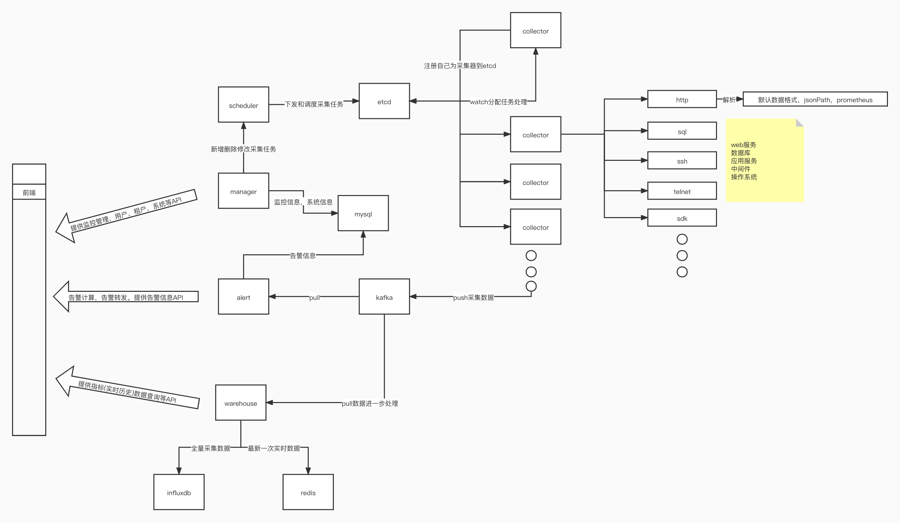

## Hertz Beat 赫兹跳动（赫兹节拍）    

暂定slogan: 面向开发者，易用友好的高性能监控系统。

### 模块  
- **[manager](manager)** 提供监控管理,系统管理基础服务   
> 开发中，提供对监控的管理，监控应用配置的管理，系统用户租户后台管理等。
- **[collector](collector)** 提供监控数据采集服务   
> 开发中，使用通用协议远程采集获取对端指标数据。  
- **[scheduler](scheduler)** 提供监控任务调度服务    
> 开发完成，采集任务管理，一次性任务和周期性任务的调度分发。
- **[warehouse](warehouse)** 提供监控数据仓储服务   
> 开发中，采集指标结果数据管理，数据落盘，查询，计算统计。
- **[alerter](alerter)** 提供告警服务   
> 待启动开发。

### 结构   

      