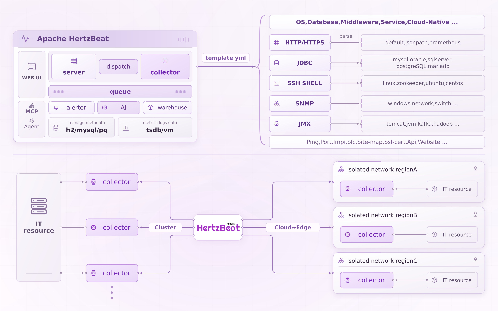

<p align="center">
  <a href="https://hertzbeat.apache.org">
     
  </a>
</p>

<p align="center">
<b>Readme</b>:
<b><a href="README.md">English</a></b> | <a href="README_CN.md">中文</a> | <a href="README_JP.md">日本語</a>
</p>

[](https://discord.gg/Fb6M73htGr)
[](https://www.reddit.com/r/hertzbeat/)
[](https://x.com/hertzbeat1024)
[](https://www.bestpractices.dev/projects/8139)
[](https://hub.docker.com/r/apache/hertzbeat)
[](https://artifacthub.io/packages/search?repo=hertzbeat)
[](https://gitpod.io/#https://github.com/apache/hertzbeat)

**Home: [hertzbeat.apache.org](https://hertzbeat.apache.org)**   
**Email: <a href="mailto:dev-subscribe@hertzbeat.apache.org">Mail to `dev-subscribe@hertzbeat.apache.org`</a> to subscribe mailing lists**


## 🎡 <font color="green">Introduction</font>

[Apache HertzBeat™](https://github.com/apache/hertzbeat) is an AI-powered next-generation open source real-time observability system. Unified metrics and logs collection, centralized alerting distribution, intelligent management and analysis. No Agent required, high performance cluster, provides powerful custom monitoring and status page building capabilities.     

### Features

- Integrates **collection + analysis + alerting + notification** into one platform, with new AI-powered interactions and features under HertzBeat AI, and built-in MCP Server capabilities.
- Unified metrics platform, agentless, Prometheus-compatible, supports application services, programs, databases, caches, operating systems, big data, middleware, web servers, cloud-native, networks, custom monitoring and more.
- Unified logging platform, seamlessly integrates multiple log sources through OTLP protocol for reporting.
- Unified alerting platform, integrates internal alerts with various external alert sources, unified alert processing and analysis, flexible real-time and periodic threshold rules, grouping convergence, silence, suppression, etc.
- Unified message distribution, alerts processed by the alerting platform are distributed via `Email` `Discord` `Slack` `Telegram` `DingTalk` `WeChat` `FeiShu` `SMS` `Webhook` `ServerChan` and other methods.
- Makes protocols such as `Http, Jmx, Ssh, Snmp, Jdbc, Prometheus` configurable, allowing you to collect any metrics by simply configuring the template `YML` file online. Imagine being able to quickly adapt to a new monitoring type like K8s or Docker simply by configuring online with HertzBeat.
- High performance, supports horizontal expansion of multi-collector clusters, multi-isolated network monitoring and cloud-edge collaboration.
- Provides powerful status page building capabilities, easily communicate the real-time status of your service to users.

> HertzBeat's unified platform, AI intelligence, powerful customization, multi-type support, high performance, and easy expansion, aims to help users quickly and conveniently achieve observability requirements.      

----

----

## 🥐 Architecture   



## 🐕 Quick Start   

- Community alpha preview users can start from [docs/alpha-preview.md](docs/alpha-preview.md) for the current
  Next.js frontend, entity-centered observability, local smoke, and known alpha limitations.

- If you wish to deploy HertzBeat locally, please refer to the following Deployment Documentation for instructions.

### 🍞 Install HertzBeat   

> HertzBeat supports installation through source code, docker or package, cpu support x86/arm64.   

##### 1：Install quickly via docker   

1. Just one command to get started

   ```shell
   docker run -d -p 1157:1157 -p 1158:1158 --name hertzbeat apache/hertzbeat
   ```

2. Access `http://localhost:1157` to start, default account: `admin/hertzbeat`  

3. Deploy collector clusters (Optional)

   ```shell
   docker run -d -e IDENTITY=custom-collector-name -e MANAGER_HOST=127.0.0.1 -e MANAGER_PORT=1158 --name hertzbeat-collector apache/hertzbeat-collector
   ```

   - `-e IDENTITY=custom-collector-name` : set the collector unique identity name.
   - `-e MODE=public` : set the running mode(public or private), public cluster or private cloud-edge.
   - `-e MANAGER_HOST=127.0.0.1` : set the main hertzbeat server ip.
   - `-e MANAGER_PORT=1158` : set the main hertzbeat server port, default 1158.


Detailed config refer to [Install HertzBeat via Docker](https://hertzbeat.apache.org/docs/start/docker-deploy)   

##### 2：Install via package  

1. Download the release package `hertzbeat-xx.tar.gz` [Download](https://hertzbeat.apache.org/docs/download)
2. Configure the HertzBeat configuration yml file `hertzbeat/config/application.yml` (optional)  
3. Run command `$ ./bin/startup.sh ` or `bin/startup.bat`   
4. Access `http://localhost:1157` to start, default account: `admin/hertzbeat`  
5. Deploy collector clusters (Optional)
    - Download the release package `hertzbeat-collector-xx.tar.gz` to new machine [Download](https://hertzbeat.apache.org/docs/download)
    - Configure the collector configuration yml file `hertzbeat-collector/config/application.yml`: unique `identity` name, running `mode` (public or private), hertzbeat `manager-host`, hertzbeat `manager-port`
      ```yaml
      collector:
        dispatch:
          entrance:
            netty:
              enabled: true
              identity: ${IDENTITY:}
              mode: ${MODE:public}
              manager-host: ${MANAGER_HOST:127.0.0.1}
              manager-port: ${MANAGER_PORT:1158}
      ```
    - Run command `$ ./bin/startup.sh ` or `bin/startup.bat`
    - Access `http://localhost:1157` and you will see the registered new collector in dashboard 

Detailed config refer to [Install HertzBeat via Package](https://hertzbeat.apache.org/docs/start/package-deploy)   

##### 3：Start via source code        

1. Local source code debugging needs to start the back-end project `hertzbeat-startup` and the front-end project `web-app`.
2. Backend: need `maven3+`, Java 25, and `lombok`; add VM options in IDE: ` --add-opens=java.base/java.nio=org.apache.arrow.memory.core,ALL-UNNAMED `, then start the `hertzbeat-startup` service.
3. Web: need `Node.js 22` and `pnpm 10`, run `corepack pnpm@10.9.0 install --frozen-lockfile && corepack pnpm@10.9.0 dev` in `web-app` after backend startup.
4. Access `http://localhost:4200` to start, default account: `admin/hertzbeat`  

Detailed steps refer to [CONTRIBUTING](CONTRIBUTING.md)        

##### 4：Install All(hertzbeat+postgresql+tsdb) via Docker-compose  

Install the postgresql/mysql database, victoria-metrics/iotdb/tdengine database and hertzbeat at one time through [docker-compose deployment script](script/docker-compose).

Detailed steps refer to [Install via Docker-Compose](script/docker-compose/README.md)      

##### 5: Install All(hertzbeat+collector+postgresql+tsdb) via kubernetes helm charts

Install HertzBeat cluster in a Kubernetes cluster by Helm chart.

Detailed steps refer to [Artifact Hub](https://artifacthub.io/packages/helm/hertzbeat/hertzbeat)

**HAVE FUN**

## ✨ Contributors

Thanks to these wonderful people, welcome to join us:
[Contributor Guide](CONTRIBUTING.md)

<a href="https://github.com/apache/hertzbeat/graphs/contributors">
  
</a>

## 💬 Join discussion

##### Channel

[Join the Mailing Lists](https://lists.apache.org/list.html?dev@hertzbeat.apache.org) : Mail to `dev-subscribe@hertzbeat.apache.org` to subscribe mailing lists.

[Chat On Discord](https://discord.gg/Fb6M73htGr)

WeChat Group : Add friend `ahertzbeat` and invite to the group.

WeChat Public : Search ID `usthecom`.

[QQ Group](https://qm.qq.com/q/xxqecSC2cw) : Group num `1035688434`

[Github Discussion](https://github.com/apache/hertzbeat/discussions)

[Reddit Community](https://www.reddit.com/r/hertzbeat/)

[Follow Us Twitter](https://x.com/hertzbeat1024)

[Subscribe YouTube](https://www.youtube.com/channel/UCri75zfWX0GHqJFPENEbLow)

##### Open-Source Project Build From Open-Source

HertzBeat is built on so many great open source projects, thanks to them!

- `Java Spring SpringBoot Jpa Maven Assembly Netty Lombok Sureness Protobuf HttpClient Guava SnakeYaml JsonPath ...`
- `TypeScript Next.js React Tailwind CSS Node.js Npm ECharts G6 MonacoEditor Docusaurus ...`

## Landscape

<p align="left">
&nbsp;&nbsp;
<br /><br />
HertzBeat has been included in the <a href="https://landscape.cncf.io/?item=observability-and-analysis--observability--hertzbeat">
CNCF Observability And Analysis - Observability Landscape.</a>
</p>

## 🛡️ License
[`Apache License, Version 2.0`](https://www.apache.org/licenses/LICENSE-2.0.html)
