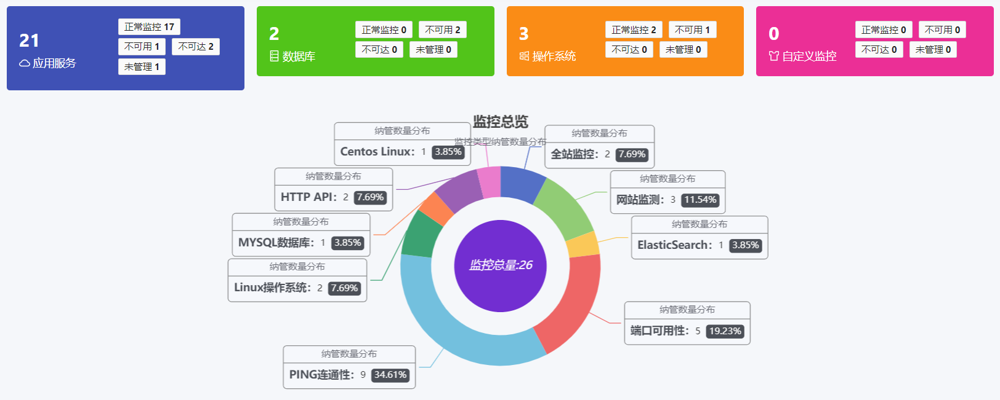
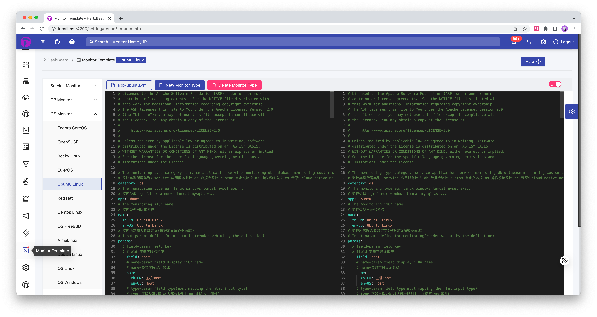

  

[comment]: <> ()

## HertzBeat 赫兹跳动 | [English Documentation](README.md)           

> 易用友好的开源实时监控告警工具，无需Agent，强大自定义监控能力。

**官网: [hertzbeat.dromara.org](https://hertzbeat.dromara.org) | [hertzbeat.com](https://hertzbeat.com)**

**云服务: [tancloud.cn](https://tancloud.cn)**

## 🎡 介绍

> [HertzBeat赫兹跳动](https://github.com/dromara/hertzbeat) 是一个拥有强大自定义监控能力，无需 Agent 的开源实时监控告警工具。     
> 集 **监控+告警+通知** 为一体，支持对应用服务，数据库，操作系统，中间件，云原生，网络等监控，阈值告警通知一步到位。   
> 更自由化的阈值规则(计算表达式)，`邮件` `Discord` `Slack` `Telegram` `钉钉` `微信` `飞书` `短信` `Webhook` 等方式及时送达。             

> 我们将`Http,Jmx,Ssh,Snmp,Jdbc`等协议规范可配置化，您只需在浏览器配置`YML`就能使用这些协议去自定义采集任何您想要的指标。    
> 您相信只需配置下就能立刻适配一款`K8s`或`Docker`等新的监控类型吗？   

> `HertzBeat`的强大自定义，多类型支持，易扩展，低耦合，希望能帮助开发者和中小团队快速搭建自有监控系统。    
> 当然我们也提供了对应的 **[SAAS版本监控云](https://console.tancloud.cn)**，中小团队和个人无需再为了监控自己的网站资源，而去部署学习一套繁琐的监控系统，**[登录即可免费开始](https://console.tancloud.cn)**。

----   

----   

## 🥐 模块  

      

## ⛄ Supported

- [网站监控](manager/src/main/resources/define/app-website.yml), [端口可用性](manager/src/main/resources/define/app-port.yml),
  [Http Api](manager/src/main/resources/define/app-api.yml), [Ping连通性](manager/src/main/resources/define/app-ping.yml),
  [Jvm](manager/src/main/resources/define/app-jvm.yml), [SiteMap全站](manager/src/main/resources/define/app-fullsite.yml),
  [Ssl证书](manager/src/main/resources/define/app-ssl_cert.yml), [SpringBoot](manager/src/main/resources/define/app-springboot2.yml),
  [FTP服务器](manager/src/main/resources/define/app-ftp.yml)
- [Mysql](manager/src/main/resources/define/app-mysql.yml), [PostgreSQL](manager/src/main/resources/define/app-postgresql.yml),
  [MariaDB](manager/src/main/resources/define/app-mariadb.yml), [Redis](manager/src/main/resources/define/app-redis.yml),
  [ElasticSearch](manager/src/main/resources/define/app-elasticsearch.yml), [SqlServer](manager/src/main/resources/define/app-sqlserver.yml),
  [Oracle](manager/src/main/resources/define/app-oracle.yml), [MongoDB](manager/src/main/resources/define/app-mongodb.yml),
  [达梦](manager/src/main/resources/define/app-dm.yml), [OpenGauss](manager/src/main/resources/define/app-opengauss.yml),
  [ClickHouse](manager/src/main/resources/define/app-clickhouse.yml), [IoTDB](manager/src/main/resources/define/app-iotdb.yml)
- [Linux](manager/src/main/resources/define/app-linux.yml), [Ubuntu](manager/src/main/resources/define/app-ubuntu.yml),
  [CentOS](manager/src/main/resources/define/app-centos.yml), [Windows](manager/src/main/resources/define/app-windows.yml)
- [Tomcat](manager/src/main/resources/define/app-tomcat.yml), [Nacos](manager/src/main/resources/define/app-nacos.yml),
  [Zookeeper](manager/src/main/resources/define/app-zookeeper.yml), [RabbitMQ](manager/src/main/resources/define/app-rabbitmq.yml),
  [Flink](manager/src/main/resources/define/app-flink.yml), [Kafka](manager/src/main/resources/define/app-kafka.yml),
  [ShenYu](manager/src/main/resources/define/app-shenyu.yml), [DynamicTp](manager/src/main/resources/define/app-dynamic_tp.yml),
  [Jetty](manager/src/main/resources/define/app-jetty.yml), [ActiveMQ](manager/src/main/resources/define/app-activemq.yml)
- [Kubernetes](manager/src/main/resources/define/app-kubernetes.yml), [Docker](manager/src/main/resources/define/app-docker.yml)
- [CiscoSwitch](manager/src/main/resources/define/app-cisco_switch.yml), [HpeSwitch](manager/src/main/resources/define/app-hpe_switch.yml),
  [HuaweiSwitch](manager/src/main/resources/define/app-huawei_switch.yml), [TpLinkSwitch](manager/src/main/resources/define/app-tplink_switch.yml)
- 和更多自定义监控类型。
- 通知支持 `Discord` `Slack` `Telegram` `邮件` `钉钉` `微信` `飞书` `短信` `Webhook`。

## 🐕 快速开始  

- 如果您不想部署而是直接使用，我们提供SAAS监控云-[TanCloud探云](https://console.tancloud.cn)，即刻 **[登录注册](https://console.tancloud.cn)** 免费使用。
- 如果您是想将HertzBeat部署到内网环境搭建监控系统，请参考下面的部署文档进行操作。  

### 🍞 HertzBeat安装
> HertzBeat支持通过源码安装启动，Docker容器运行和安装包方式安装部署，CPU架构支持X86/ARM64。

##### 方式一：Docker方式快速安装  

1. `docker` 环境仅需一条命令即可开始     

`docker run -d -p 1157:1157 --name hertzbeat tancloud/hertzbeat` 

2. 浏览器访问 `localhost:1157` 即可开始，默认账号密码 `admin/hertzbeat`

更多配置详细步骤参考 [通过Docker方式安装HertzBeat](https://hertzbeat.com/docs/start/docker-deploy)

##### 方式二：通过安装包安装
1. 下载您系统环境对应的安装包 [GITEE Release](https://gitee.com/dromara/hertzbeat/releases) [GITHUB Release](https://github.com/dromara/hertzbeat/releases)
2. 需要已安装`java11`环境   
3. 配置 HertzBeat 的配置文件 `hertzbeat/config/application.yml`(可选)
4. 部署启动 `$ ./startup.sh ` 或 `startup.bat`(如果在多java环境中，环境变量中配置了其他java环境如`java8`，没有`java11`，需编辑`$ ./startup.sh ` 或 `startup.bat`手动指定java路径，`startup.sh`在第一行添加`JAVA_HOME=${JAVA_DIR}`，`startup.bat`修改`start javaw %JAVA_OPTS% %JAVA_MEM_OPTS% %CONFIG_FILES% -jar %DEPLOY_DIR%\%JAR_NAME% >logs\startup.log 2>&1 &`中的`javaw`为`java11`的路径，如`C:\Users\user\.jdks\corretto-11.0.18\bin\javaw`)
5. 浏览器访问 `localhost:1157` 即可开始，默认账号密码 `admin/hertzbeat`

更多配置详细步骤参考 [通过安装包安装HertzBeat](https://hertzbeat.com/docs/start/package-deploy)

##### 方式三：本地代码启动
1. 此为前后端分离项目，本地代码调试需要分别启动后端工程`manager`和前端工程`web-app`
2. 后端：需要`maven3+`, `java11`和`lombok`环境，修改`YML`配置信息并启动`manager`服务
3. 前端：需要`nodejs npm angular-cli`环境，待本地后端启动后，在`web-app`目录下启动 `ng serve --open`
4. 浏览器访问 `localhost:4200` 即可开始，默认账号密码 `admin/hertzbeat`

详细步骤参考 [参与贡献之本地代码启动](CONTRIBUTING.md)

##### 方式四：Docker-Compose 统一安装 hertzbeat+mysql+iotdb/tdengine

通过 [Docker-Compose 部署脚本](script/docker-compose) 一次性把 mysql 数据库, iotdb/tdengine 时序数据库和 hertzbeat 安装部署。

详细步骤参考 [通过Docker-Compose安装HertzBeat](script/docker-compose/README.md)  

**HAVE FUN**

## 🥐 路线图

## ✨ Contributors

Thanks these wonderful people, welcome to join us:   
[贡献者指南](CONTRIBUTING.md)    

<!-- ALL-CONTRIBUTORS-LIST:START - Do not remove or modify this section -->
<!-- prettier-ignore-start -->
<!-- markdownlint-disable -->
<table>
  <tbody>
    <tr>
      <td align="center" valign="top" width="14.28%"><a href="https://github.com/tomsun28"> <b>tomsun28</b></a> <a href="https://github.com/dromara/hertzbeat/commits?author=tomsun28" title="Code">💻</a> <a href="https://github.com/dromara/hertzbeat/commits?author=tomsun28" title="Documentation">📖</a> <a href="#design-tomsun28" title="Design">🎨</a></td>
      <td align="center" valign="top" width="14.28%"><a href="https://github.com/wang1027-wqh"> <b>会编程的王学长</b></a> <a href="https://github.com/dromara/hertzbeat/commits?author=wang1027-wqh" title="Code">💻</a> <a href="https://github.com/dromara/hertzbeat/commits?author=wang1027-wqh" title="Documentation">📖</a> <a href="#design-wang1027-wqh" title="Design">🎨</a></td>
      <td align="center" valign="top" width="14.28%"><a href="https://www.maxkey.top/"> <b>MaxKey</b></a> <a href="https://github.com/dromara/hertzbeat/commits?author=shimingxy" title="Code">💻</a> <a href="#design-shimingxy" title="Design">🎨</a> <a href="#ideas-shimingxy" title="Ideas, Planning, & Feedback">🤔</a></td>
      <td align="center" valign="top" width="14.28%"><a href="https://blog.gcdd.top/"> <b>观沧海</b></a> <a href="https://github.com/dromara/hertzbeat/commits?author=gcdd1993" title="Code">💻</a> <a href="#design-gcdd1993" title="Design">🎨</a> <a href="https://github.com/dromara/hertzbeat/issues?q=author%3Agcdd1993" title="Bug reports">🐛</a></td>
      <td align="center" valign="top" width="14.28%"><a href="https://github.com/a25017012"> <b>yuye</b></a> <a href="https://github.com/dromara/hertzbeat/commits?author=a25017012" title="Code">💻</a> <a href="https://github.com/dromara/hertzbeat/commits?author=a25017012" title="Documentation">📖</a></td>
      <td align="center" valign="top" width="14.28%"><a href="https://github.com/jx10086"> <b>jx10086</b></a> <a href="https://github.com/dromara/hertzbeat/commits?author=jx10086" title="Code">💻</a> <a href="https://github.com/dromara/hertzbeat/issues?q=author%3Ajx10086" title="Bug reports">🐛</a></td>
      <td align="center" valign="top" width="14.28%"><a href="https://github.com/winnerTimer"> <b>winnerTimer</b></a> <a href="https://github.com/dromara/hertzbeat/commits?author=winnerTimer" title="Code">💻</a> <a href="https://github.com/dromara/hertzbeat/issues?q=author%3AwinnerTimer" title="Bug reports">🐛</a></td>
    </tr>
    <tr>
      <td align="center" valign="top" width="14.28%"><a href="https://github.com/goo-kits"> <b>goo-kits</b></a> <a href="https://github.com/dromara/hertzbeat/commits?author=goo-kits" title="Code">💻</a> <a href="https://github.com/dromara/hertzbeat/issues?q=author%3Agoo-kits" title="Bug reports">🐛</a></td>
      <td align="center" valign="top" width="14.28%"><a href="https://github.com/brave4Time"> <b>brave4Time</b></a> <a href="https://github.com/dromara/hertzbeat/commits?author=brave4Time" title="Code">💻</a> <a href="https://github.com/dromara/hertzbeat/issues?q=author%3Abrave4Time" title="Bug reports">🐛</a></td>
      <td align="center" valign="top" width="14.28%"><a href="https://github.com/walkerlee-lab"> <b>WalkerLee</b></a> <a href="https://github.com/dromara/hertzbeat/commits?author=walkerlee-lab" title="Code">💻</a> <a href="https://github.com/dromara/hertzbeat/issues?q=author%3Awalkerlee-lab" title="Bug reports">🐛</a></td>
      <td align="center" valign="top" width="14.28%"><a href="https://github.com/fullofjoy"> <b>jianghang</b></a> <a href="https://github.com/dromara/hertzbeat/commits?author=fullofjoy" title="Code">💻</a> <a href="https://github.com/dromara/hertzbeat/issues?q=author%3Afullofjoy" title="Bug reports">🐛</a></td>
      <td align="center" valign="top" width="14.28%"><a href="https://github.com/ChineseTony"> <b>ChineseTony</b></a> <a href="https://github.com/dromara/hertzbeat/commits?author=ChineseTony" title="Code">💻</a> <a href="https://github.com/dromara/hertzbeat/issues?q=author%3AChineseTony" title="Bug reports">🐛</a></td>
      <td align="center" valign="top" width="14.28%"><a href="https://github.com/wyt199905"> <b>wyt199905</b></a> <a href="https://github.com/dromara/hertzbeat/commits?author=wyt199905" title="Code">💻</a></td>
      <td align="center" valign="top" width="14.28%"><a href="https://github.com/weifuqing"> <b>卫傅庆</b></a> <a href="https://github.com/dromara/hertzbeat/commits?author=weifuqing" title="Code">💻</a> <a href="https://github.com/dromara/hertzbeat/issues?q=author%3Aweifuqing" title="Bug reports">🐛</a></td>
    </tr>
    <tr>
      <td align="center" valign="top" width="14.28%"><a href="https://github.com/zklmcookle"> <b>zklmcookle</b></a> <a href="https://github.com/dromara/hertzbeat/commits?author=zklmcookle" title="Code">💻</a></td>
      <td align="center" valign="top" width="14.28%"><a href="https://github.com/DevilX5"> <b>DevilX5</b></a> <a href="https://github.com/dromara/hertzbeat/commits?author=DevilX5" title="Documentation">📖</a> <a href="https://github.com/dromara/hertzbeat/commits?author=DevilX5" title="Code">💻</a></td>
      <td align="center" valign="top" width="14.28%"><a href="https://github.com/djzeng"> <b>tea</b></a> <a href="https://github.com/dromara/hertzbeat/commits?author=djzeng" title="Code">💻</a></td>
      <td align="center" valign="top" width="14.28%"><a href="https://github.com/yangshihui"> <b>yangshihui</b></a> <a href="https://github.com/dromara/hertzbeat/commits?author=yangshihui" title="Code">💻</a> <a href="https://github.com/dromara/hertzbeat/issues?q=author%3Ayangshihui" title="Bug reports">🐛</a></td>
      <td align="center" valign="top" width="14.28%"><a href="https://github.com/DreamGirl524"> <b>DreamGirl524</b></a> <a href="https://github.com/dromara/hertzbeat/commits?author=DreamGirl524" title="Code">💻</a> <a href="https://github.com/dromara/hertzbeat/commits?author=DreamGirl524" title="Documentation">📖</a></td>
      <td align="center" valign="top" width="14.28%"><a href="https://github.com/gzwlly"> <b>gzwlly</b></a> <a href="https://github.com/dromara/hertzbeat/commits?author=gzwlly" title="Documentation">📖</a></td>
      <td align="center" valign="top" width="14.28%"><a href="https://github.com/cuipiheqiuqiu"> <b>cuipiheqiuqiu</b></a> <a href="https://github.com/dromara/hertzbeat/commits?author=cuipiheqiuqiu" title="Code">💻</a> <a href="https://github.com/dromara/hertzbeat/commits?author=cuipiheqiuqiu" title="Tests">⚠️</a> <a href="#design-cuipiheqiuqiu" title="Design">🎨</a></td>
    </tr>
    <tr>
      <td align="center" valign="top" width="14.28%"><a href="https://github.com/oyiyou"> <b>lambert</b></a> <a href="https://github.com/dromara/hertzbeat/commits?author=oyiyou" title="Code">💻</a></td>
      <td align="center" valign="top" width="14.28%"><a href="http://mroldx.xyz/"> <b>mroldx</b></a> <a href="https://github.com/dromara/hertzbeat/commits?author=mroldx" title="Documentation">📖</a></td>
      <td align="center" valign="top" width="14.28%"><a href="https://github.com/woshiniusange"> <b>woshiniusange</b></a> <a href="https://github.com/dromara/hertzbeat/commits?author=woshiniusange" title="Documentation">📖</a></td>
      <td align="center" valign="top" width="14.28%"><a href="https://vampireachao.github.io/"> <b>VampireAchao</b></a> <a href="https://github.com/dromara/hertzbeat/commits?author=VampireAchao" title="Code">💻</a></td>
      <td align="center" valign="top" width="14.28%"><a href="https://github.com/Ceilzcx"> <b>zcx</b></a> <a href="https://github.com/dromara/hertzbeat/commits?author=Ceilzcx" title="Code">💻</a> <a href="https://github.com/dromara/hertzbeat/issues?q=author%3ACeilzcx" title="Bug reports">🐛</a> <a href="#design-Ceilzcx" title="Design">🎨</a></td>
      <td align="center" valign="top" width="14.28%"><a href="https://github.com/CharlieXCL"> <b>CharlieXCL</b></a> <a href="https://github.com/dromara/hertzbeat/commits?author=CharlieXCL" title="Documentation">📖</a></td>
      <td align="center" valign="top" width="14.28%"><a href="https://github.com/Privauto"> <b>Privauto</b></a> <a href="https://github.com/dromara/hertzbeat/commits?author=Privauto" title="Code">💻</a> <a href="https://github.com/dromara/hertzbeat/commits?author=Privauto" title="Documentation">📖</a></td>
    </tr>
    <tr>
      <td align="center" valign="top" width="14.28%"><a href="https://github.com/emrys-he"> <b>emrys</b></a> <a href="https://github.com/dromara/hertzbeat/commits?author=emrys-he" title="Documentation">📖</a></td>
      <td align="center" valign="top" width="14.28%"><a href="https://github.com/SxLiuYu"> <b>SxLiuYu</b></a> <a href="https://github.com/dromara/hertzbeat/issues?q=author%3ASxLiuYu" title="Bug reports">🐛</a></td>
      <td align="center" valign="top" width="14.28%"><a href="https://allcontributors.org"> <b>All Contributors</b></a> <a href="https://github.com/dromara/hertzbeat/commits?author=all-contributors" title="Documentation">📖</a></td>
      <td align="center" valign="top" width="14.28%"><a href="https://github.com/gxc-myh"> <b>铁甲小宝</b></a> <a href="https://github.com/dromara/hertzbeat/commits?author=gxc-myh" title="Code">💻</a> <a href="https://github.com/dromara/hertzbeat/commits?author=gxc-myh" title="Documentation">📖</a></td>
      <td align="center" valign="top" width="14.28%"><a href="https://github.com/click33"> <b>click33</b></a> <a href="https://github.com/dromara/hertzbeat/commits?author=click33" title="Documentation">📖</a></td>
      <td align="center" valign="top" width="14.28%"><a href="https://jpom.io/"> <b>蒋小小</b></a> <a href="https://github.com/dromara/hertzbeat/commits?author=bwcx-jzy" title="Documentation">📖</a></td>
      <td align="center" valign="top" width="14.28%"><a href="https://www.zhihu.com/people/kevinbauer"> <b>Kevin Huang</b></a> <a href="https://github.com/dromara/hertzbeat/commits?author=kevinhuangwl" title="Documentation">📖</a></td>
    </tr>
    <tr>
      <td align="center" valign="top" width="14.28%"><a href="https://github.com/TJxiaobao"> <b>铁甲小宝</b></a> <a href="https://github.com/dromara/hertzbeat/issues?q=author%3ATJxiaobao" title="Bug reports">🐛</a> <a href="https://github.com/dromara/hertzbeat/commits?author=TJxiaobao" title="Code">💻</a> <a href="https://github.com/dromara/hertzbeat/commits?author=TJxiaobao" title="Documentation">📖</a></td>
      <td align="center" valign="top" width="14.28%"><a href="https://github.com/Jack-123-power"> <b>Captain Jack</b></a> <a href="https://github.com/dromara/hertzbeat/commits?author=Jack-123-power" title="Documentation">📖</a></td>
      <td align="center" valign="top" width="14.28%"><a href="https://github.com/haibo-duan"> <b>haibo.duan</b></a> <a href="https://github.com/dromara/hertzbeat/commits?author=haibo-duan" title="Tests">⚠️</a> <a href="https://github.com/dromara/hertzbeat/commits?author=haibo-duan" title="Code">💻</a></td>
      <td align="center" valign="top" width="14.28%"><a href="https://github.com/assassinfym"> <b>assassin</b></a> <a href="https://github.com/dromara/hertzbeat/issues?q=author%3Aassassinfym" title="Bug reports">🐛</a> <a href="https://github.com/dromara/hertzbeat/commits?author=assassinfym" title="Code">💻</a></td>
      <td align="center" valign="top" width="14.28%"><a href="https://github.com/csyshu"> <b>Reverse wind</b></a> <a href="https://github.com/dromara/hertzbeat/commits?author=csyshu" title="Tests">⚠️</a> <a href="https://github.com/dromara/hertzbeat/commits?author=csyshu" title="Code">💻</a></td>
      <td align="center" valign="top" width="14.28%"><a href="https://github.com/luxx-lq"> <b>luxx</b></a> <a href="https://github.com/dromara/hertzbeat/commits?author=luxx-lq" title="Code">💻</a></td>
      <td align="center" valign="top" width="14.28%"><a href="https://bandism.net/"> <b>Ikko Ashimine</b></a> <a href="https://github.com/dromara/hertzbeat/commits?author=eltociear" title="Documentation">📖</a></td>
    </tr>
    <tr>
      <td align="center" valign="top" width="14.28%"><a href="https://github.com/zenan08"> <b>leizenan</b></a> <a href="https://github.com/dromara/hertzbeat/commits?author=zenan08" title="Code">💻</a></td>
      <td align="center" valign="top" width="14.28%"><a href="https://github.com/BKing2020"> <b>BKing</b></a> <a href="https://github.com/dromara/hertzbeat/commits?author=BKing2020" title="Documentation">📖</a></td>
      <td align="center" valign="top" width="14.28%"><a href="https://github.com/xingshuaiLi"> <b>xingshuaiLi</b></a> <a href="https://github.com/dromara/hertzbeat/commits?author=xingshuaiLi" title="Documentation">📖</a></td>
      <td align="center" valign="top" width="14.28%"><a href="https://github.com/wangke6666"> <b>wangke6666</b></a> <a href="https://github.com/dromara/hertzbeat/commits?author=wangke6666" title="Documentation">📖</a></td>
      <td align="center" valign="top" width="14.28%"><a href="https://github.com/LWBobo"> <b>刺猬</b></a> <a href="https://github.com/dromara/hertzbeat/issues?q=author%3ALWBobo" title="Bug reports">🐛</a> <a href="https://github.com/dromara/hertzbeat/commits?author=LWBobo" title="Code">💻</a></td>
      <td align="center" valign="top" width="14.28%"><a href="http://www.zanglikun.com"> <b>Haste</b></a> <a href="https://github.com/dromara/hertzbeat/commits?author=zanglikun" title="Code">💻</a></td>
      <td align="center" valign="top" width="14.28%"><a href="https://github.com/SuitSmile"> <b>zhongshi.yi</b></a> <a href="https://github.com/dromara/hertzbeat/commits?author=SuitSmile" title="Documentation">📖</a></td>
    </tr>
    <tr>
      <td align="center" valign="top" width="14.28%"><a href="https://www.smallq.cn"> <b>Qi Zhang</b></a> <a href="https://github.com/dromara/hertzbeat/commits?author=zzzhangqi" title="Documentation">📖</a></td>
      <td align="center" valign="top" width="14.28%"><a href="https://github.com/MrAndyMing"> <b>MrAndyMing</b></a> <a href="https://github.com/dromara/hertzbeat/commits?author=MrAndyMing" title="Documentation">📖</a></td>
      <td align="center" valign="top" width="14.28%"><a href="https://idongliming.github.io/"> <b>idongliming</b></a> <a href="https://github.com/dromara/hertzbeat/commits?author=idongliming" title="Code">💻</a></td>
      <td align="center" valign="top" width="14.28%"><a href="https://earthjasonlin.github.io"> <b>Zichao Lin</b></a> <a href="https://github.com/dromara/hertzbeat/commits?author=earthjasonlin" title="Code">💻</a> <a href="https://github.com/dromara/hertzbeat/commits?author=earthjasonlin" title="Documentation">📖</a></td>
      <td align="center" valign="top" width="14.28%"><a href="http://blog.liudonghua.com"> <b>liudonghua</b></a> <a href="https://github.com/dromara/hertzbeat/commits?author=liudonghua123" title="Code">💻</a> <a href="#ideas-liudonghua123" title="Ideas, Planning, & Feedback">🤔</a></td>
      <td align="center" valign="top" width="14.28%"><a href="https://github.com/orangeyts"> <b>Jerry</b></a> <a href="https://github.com/dromara/hertzbeat/commits?author=orangeyts" title="Code">💻</a> <a href="https://github.com/dromara/hertzbeat/commits?author=orangeyts" title="Tests">⚠️</a> <a href="#ideas-orangeyts" title="Ideas, Planning, & Feedback">🤔</a></td>
      <td align="center" valign="top" width="14.28%"><a href="https://dynamictp.cn"> <b>yanhom</b></a> <a href="https://github.com/dromara/hertzbeat/commits?author=yanhom1314" title="Documentation">📖</a></td>
    </tr>
    <tr>
      <td align="center" valign="top" width="14.28%"><a href="https://www.jianshu.com/u/a8f822c04f67"> <b>fsl</b></a> <a href="https://github.com/dromara/hertzbeat/commits?author=fengshunli" title="Code">💻</a></td>
      <td align="center" valign="top" width="14.28%"><a href="https://github.com/xttttv"> <b>xttttv</b></a> <a href="https://github.com/dromara/hertzbeat/commits?author=xttttv" title="Documentation">📖</a></td>
      <td align="center" valign="top" width="14.28%"><a href="https://github.com/NavinKumarBarnwal"> <b>NavinKumarBarnwal</b></a> <a href="https://github.com/dromara/hertzbeat/commits?author=NavinKumarBarnwal" title="Code">💻</a></td>
      <td align="center" valign="top" width="14.28%"><a href="https://github.com/z641205699"> <b>Zakkary</b></a> <a href="https://github.com/dromara/hertzbeat/commits?author=z641205699" title="Documentation">📖</a></td>
      <td align="center" valign="top" width="14.28%"><a href="https://github.com/898349230"> <b>sunxinbo</b></a> <a href="https://github.com/dromara/hertzbeat/commits?author=898349230" title="Code">💻</a> <a href="https://github.com/dromara/hertzbeat/commits?author=898349230" title="Tests">⚠️</a></td>
      <td align="center" valign="top" width="14.28%"><a href="https://github.com/ldzbook"> <b>ldzbook</b></a> <a href="https://github.com/dromara/hertzbeat/commits?author=ldzbook" title="Documentation">📖</a> <a href="https://github.com/dromara/hertzbeat/issues?q=author%3Aldzbook" title="Bug reports">🐛</a></td>
      <td align="center" valign="top" width="14.28%"><a href="https://github.com/SurryChen"> <b>余与雨</b></a> <a href="https://github.com/dromara/hertzbeat/commits?author=SurryChen" title="Code">💻</a> <a href="https://github.com/dromara/hertzbeat/commits?author=SurryChen" title="Tests">⚠️</a></td>
    </tr>
    <tr>
      <td align="center" valign="top" width="14.28%"><a href="https://github.com/MysticalDream"> <b>MysticalDream</b></a> <a href="https://github.com/dromara/hertzbeat/commits?author=MysticalDream" title="Code">💻</a> <a href="https://github.com/dromara/hertzbeat/commits?author=MysticalDream" title="Tests">⚠️</a></td>
      <td align="center" valign="top" width="14.28%"><a href="https://github.com/zhouyoulin12"> <b>zhouyoulin12</b></a> <a href="https://github.com/dromara/hertzbeat/commits?author=zhouyoulin12" title="Code">💻</a> <a href="https://github.com/dromara/hertzbeat/commits?author=zhouyoulin12" title="Tests">⚠️</a></td>
      <td align="center" valign="top" width="14.28%"><a href="https://github.com/jerjjj"> <b>jerjjj</b></a> <a href="https://github.com/dromara/hertzbeat/commits?author=jerjjj" title="Code">💻</a></td>
      <td align="center" valign="top" width="14.28%"><a href="https://wjl110.xyz/"> <b>wjl110</b></a> <a href="https://github.com/dromara/hertzbeat/commits?author=wjl110" title="Code">💻</a></td>
      <td align="center" valign="top" width="14.28%"><a href="https://github.com/ngyhd"> <b>Sean</b></a> <a href="https://github.com/dromara/hertzbeat/commits?author=ngyhd" title="Documentation">📖</a></td>
      <td align="center" valign="top" width="14.28%"><a href="https://github.com/Daydreamer-ia"> <b>chenyiqin</b></a> <a href="https://github.com/dromara/hertzbeat/commits?author=Daydreamer-ia" title="Code">💻</a> <a href="https://github.com/dromara/hertzbeat/commits?author=Daydreamer-ia" title="Tests">⚠️</a></td>
      <td align="center" valign="top" width="14.28%"><a href="https://github.com/hudongdong129"> <b>hudongdong129</b></a> <a href="https://github.com/dromara/hertzbeat/commits?author=hudongdong129" title="Code">💻</a> <a href="https://github.com/dromara/hertzbeat/commits?author=hudongdong129" title="Tests">⚠️</a> <a href="https://github.com/dromara/hertzbeat/commits?author=hudongdong129" title="Documentation">📖</a></td>
    </tr>
    <tr>
      <td align="center" valign="top" width="14.28%"><a href="https://github.com/TherChenYang"> <b>TherChenYang</b></a> <a href="https://github.com/dromara/hertzbeat/commits?author=TherChenYang" title="Code">💻</a> <a href="https://github.com/dromara/hertzbeat/commits?author=TherChenYang" title="Tests">⚠️</a></td>
      <td align="center" valign="top" width="14.28%"><a href="https://github.com/HattoriHenzo"> <b>HattoriHenzo</b></a> <a href="https://github.com/dromara/hertzbeat/commits?author=HattoriHenzo" title="Code">💻</a> <a href="https://github.com/dromara/hertzbeat/commits?author=HattoriHenzo" title="Tests">⚠️</a></td>
      <td align="center" valign="top" width="14.28%"><a href="https://github.com/ycilry"> <b>ycilry</b></a> <a href="https://github.com/dromara/hertzbeat/commits?author=ycilry" title="Documentation">📖</a></td>
      <td align="center" valign="top" width="14.28%"><a href="https://github.com/aoshiguchen"> <b>aoshiguchen</b></a> <a href="https://github.com/dromara/hertzbeat/commits?author=aoshiguchen" title="Documentation">📖</a> <a href="https://github.com/dromara/hertzbeat/commits?author=aoshiguchen" title="Code">💻</a></td>
      <td align="center" valign="top" width="14.28%"><a href="https://github.com/caibenxiang"> <b>蔡本祥</b></a> <a href="https://github.com/dromara/hertzbeat/commits?author=caibenxiang" title="Code">💻</a></td>
      <td align="center" valign="top" width="14.28%"><a href="http://www.fckeverything.cn:4000/"> <b>浮游</b></a> <a href="https://github.com/dromara/hertzbeat/commits?author=lifefloating" title="Code">💻</a></td>
      <td align="center" valign="top" width="14.28%"><a href="https://github.com/Grass-Life"> <b>Grass-Life</b></a> <a href="https://github.com/dromara/hertzbeat/commits?author=Grass-Life" title="Code">💻</a></td>
    </tr>
    <tr>
      <td align="center" valign="top" width="14.28%"><a href="https://github.com/xiaohe428"> <b>xiaohe428</b></a> <a href="https://github.com/dromara/hertzbeat/commits?author=xiaohe428" title="Code">💻</a> <a href="https://github.com/dromara/hertzbeat/commits?author=xiaohe428" title="Documentation">📖</a></td>
      <td align="center" valign="top" width="14.28%"><a href="https://github.com/baiban114"> <b>TableRow</b></a> <a href="https://github.com/dromara/hertzbeat/commits?author=baiban114" title="Documentation">📖</a></td>
      <td align="center" valign="top" width="14.28%"><a href="https://github.com/ByteIDance"> <b>ByteIDance</b></a> <a href="https://github.com/dromara/hertzbeat/commits?author=ByteIDance" title="Code">💻</a></td>
      <td align="center" valign="top" width="14.28%"><a href="https://github.com/mangel2002"> <b>Jangfe</b></a> <a href="https://github.com/dromara/hertzbeat/commits?author=mangel2002" title="Code">💻</a></td>
      <td align="center" valign="top" width="14.28%"><a href="https://github.com/zqr10159"> <b>zqr10159</b></a> <a href="https://github.com/dromara/hertzbeat/commits?author=zqr10159" title="Documentation">📖</a> <a href="https://github.com/dromara/hertzbeat/commits?author=zqr10159" title="Code">💻</a></td>
      <td align="center" valign="top" width="14.28%"><a href="https://github.com/vinci-897"> <b>vinci</b></a> <a href="https://github.com/dromara/hertzbeat/commits?author=vinci-897" title="Code">💻</a></td>
      <td align="center" valign="top" width="14.28%"><a href="https://github.com/js110"> <b>js110</b></a> <a href="https://github.com/dromara/hertzbeat/commits?author=js110" title="Code">💻</a></td>
    </tr>
    <tr>
      <td align="center" valign="top" width="14.28%"><a href="https://github.com/JavaLionLi"> <b>CrazyLionLi</b></a> <a href="https://github.com/dromara/hertzbeat/commits?author=JavaLionLi" title="Documentation">📖</a></td>
      <td align="center" valign="top" width="14.28%"><a href="http://www.banmajio.com"> <b>banmajio</b></a> <a href="https://github.com/dromara/hertzbeat/commits?author=banmajio" title="Code">💻</a></td>
      <td align="center" valign="top" width="14.28%"><a href="https://suder.fun"> <b>topsuder</b></a> <a href="https://github.com/dromara/hertzbeat/commits?author=topsuder" title="Code">💻</a></td>
      <td align="center" valign="top" width="14.28%"><a href="https://github.com/richar2022"> <b>richar2022</b></a> <a href="https://github.com/dromara/hertzbeat/commits?author=richar2022" title="Code">💻</a></td>
      <td align="center" valign="top" width="14.28%"><a href="https://github.com/fcb-xiaobo"> <b>fcb-xiaobo</b></a> <a href="https://github.com/dromara/hertzbeat/commits?author=fcb-xiaobo" title="Code">💻</a></td>
      <td align="center" valign="top" width="14.28%"><a href="https://github.com/wenkyzhang"> <b>wenkyzhang</b></a> <a href="https://github.com/dromara/hertzbeat/commits?author=wenkyzhang" title="Documentation">📖</a></td>
      <td align="center" valign="top" width="14.28%"><a href="https://github.com/ZangJuxy"> <b>ZangJuxy</b></a> <a href="https://github.com/dromara/hertzbeat/commits?author=ZangJuxy" title="Documentation">📖</a></td>
    </tr>
    <tr>
      <td align="center" valign="top" width="14.28%"><a href="https://github.com/l646505418"> <b>l646505418</b></a> <a href="https://github.com/dromara/hertzbeat/commits?author=l646505418" title="Code">💻</a></td>
      <td align="center" valign="top" width="14.28%"><a href="http://www.carpewang.com"> <b>Carpe-Wang</b></a> <a href="https://github.com/dromara/hertzbeat/commits?author=Carpe-Wang" title="Code">💻</a></td>
      <td align="center" valign="top" width="14.28%"><a href="https://github.com/moshu023"> <b>莫枢</b></a> <a href="https://github.com/dromara/hertzbeat/commits?author=moshu023" title="Code">💻</a></td>
      <td align="center" valign="top" width="14.28%"><a href="https://github.com/huangcanda"> <b>huangcanda</b></a> <a href="https://github.com/dromara/hertzbeat/commits?author=huangcanda" title="Code">💻</a></td>
      <td align="center" valign="top" width="14.28%"><a href="https://www.zrkizzy.com"> <b>世纪末的架构师</b></a> <a href="https://github.com/dromara/hertzbeat/commits?author=Architect-Java" title="Code">💻</a></td>
      <td align="center" valign="top" width="14.28%"><a href="https://github.com/ShuningWan"> <b>ShuningWan</b></a> <a href="https://github.com/dromara/hertzbeat/commits?author=ShuningWan" title="Documentation">📖</a></td>
      <td align="center" valign="top" width="14.28%"><a href="https://github.com/MrYZhou"> <b>MrYZhou</b></a> <a href="https://github.com/dromara/hertzbeat/commits?author=MrYZhou" title="Documentation">📖</a></td>
    </tr>
    <tr>
      <td align="center" valign="top" width="14.28%"><a href="https://github.com/suncqujsj"> <b>suncqujsj</b></a> <a href="https://github.com/dromara/hertzbeat/commits?author=suncqujsj" title="Documentation">📖</a></td>
      <td align="center" valign="top" width="14.28%"><a href="https://github.com/sunqinbo"> <b>sunqinbo</b></a> <a href="https://github.com/dromara/hertzbeat/commits?author=sunqinbo" title="Code">💻</a></td>
      <td align="center" valign="top" width="14.28%"><a href="https://github.com/haoww"> <b>haoww</b></a> <a href="https://github.com/dromara/hertzbeat/commits?author=haoww" title="Documentation">📖</a></td>
      <td align="center" valign="top" width="14.28%"><a href="https://github.com/i-mayuan"> <b>i-mayuan</b></a> <a href="https://github.com/dromara/hertzbeat/commits?author=i-mayuan" title="Documentation">📖</a></td>
      <td align="center" valign="top" width="14.28%"><a href="https://github.com/fengruge"> <b>fengruge</b></a> <a href="https://github.com/dromara/hertzbeat/commits?author=fengruge" title="Documentation">📖</a></td>
      <td align="center" valign="top" width="14.28%"><a href="https://github.com/aystzh"> <b>zhanghuan</b></a> <a href="https://github.com/dromara/hertzbeat/commits?author=aystzh" title="Code">💻</a></td>
      <td align="center" valign="top" width="14.28%"><a href="https://github.com/shenyumin"> <b>shenymin</b></a> <a href="https://github.com/dromara/hertzbeat/commits?author=shenyumin" title="Code">💻</a></td>
    </tr>
    <tr>
      <td align="center" valign="top" width="14.28%"><a href="https://github.com/dhruva1995"> <b>Dhruva Chandra</b></a> <a href="https://github.com/dromara/hertzbeat/commits?author=dhruva1995" title="Code">💻</a></td>
      <td align="center" valign="top" width="14.28%"><a href="https://github.com/weiwang988"> <b>miss_z</b></a> <a href="https://github.com/dromara/hertzbeat/commits?author=weiwang988" title="Documentation">📖</a></td>
      <td align="center" valign="top" width="14.28%"><a href="https://github.com/wyt990"> <b>wyt990</b></a> <a href="https://github.com/dromara/hertzbeat/commits?author=wyt990" title="Code">💻</a></td>
      <td align="center" valign="top" width="14.28%"><a href="https://github.com/licocon"> <b>licocon</b></a> <a href="https://github.com/dromara/hertzbeat/commits?author=licocon" title="Code">💻</a></td>
      <td align="center" valign="top" width="14.28%"><a href="https://github.com/2406450951"> <b>Mi Na</b></a> <a href="https://github.com/dromara/hertzbeat/commits?author=2406450951" title="Code">💻</a></td>
    </tr>
  </tbody>
</table>

<!-- markdownlint-restore -->
<!-- prettier-ignore-end -->

<!-- ALL-CONTRIBUTORS-LIST:END -->  

## 💬 社区交流

HertzBeat 赫兹跳动是 [Dromara开源社区](https://dromara.org/) 下项目。   

##### 微信交流群

加微信号 tan-cloud 或 扫描下面账号二维码拉您进微信群。   

##### QQ交流群

加QQ群号 236915833 或 扫描下面的群二维码进群

          

##### Channel 

[Gitter Channel](https://gitter.im/hertzbeat/community)   

[Github Discussion](https://github.com/dromara/hertzbeat/discussions)

[User Club](https://support.qq.com/products/379369)    

##### 公众号与星球     

  

 

    

##### 友情链接   

- [DynamicTp](https://github.com/dromara/dynamic-tp) : 轻量级动态线程池，内置监控告警功能，集成三方中间件线程池管理，基于主流配置中心
- [Hippo4j](https://github.com/opengoofy/hippo4j/) : 强大的动态线程池框架，附带监控报警功能      
- [Jpom](https://gitee.com/dromara/Jpom) : 简而轻的低侵入式在线构建、自动部署、日常运维、项目监控软件   
- [ArgusDBM](https://github.com/zmops/ArgusDBM) : 开源数据库一体化监控平台，致力于监控所有数据库

##### 赞助     
- Postcat [开源 API 管理工具 ](https://datayi.cn/w/xRxVBBko) 简单可拓展，支持 API 测试、文档、Mock、团队协作等核心功能
- 感谢 [吉实信息(构建全新的微波+光交易网络)](https://www.flarespeed.com) 赞助服务器采集节点     
- 感谢 [蓝易云(全新智慧上云)](https://www.tsyvps.com/aff/BZBEGYLX) 赞助服务器采集节点        

## 🛡️ License
[`Apache License, Version 2.0`](https://www.apache.org/licenses/LICENSE-2.0.html)
