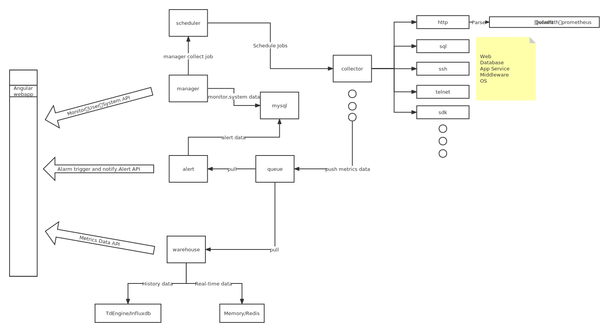

  

[comment]: <> ()

## HertzBeat | [中文文档](README.md)   

> Friendly cloud monitoring system.  

**Home: [hertzbeat.com](https://hertzbeat.com) | [tancloud.cn](https://tancloud.cn)**

Running HertzBeat in [OSCR.COM](https://osrc.com) Open Source Runtime Community - [Doc](https://osrc.com/user/articles/wiki_776513931985080320)   

## 🎡 Introduction

> [HertzBeat](https://github.com/dromara/hertzbeat) is an opensource monitoring and alarm project incubated by [Dromara](https://dromara.org) and open sourced by [TanCloud](https://tancloud.cn), which supports Website, API, PING, Port, Database, OS Monitor etc.        
> We also provide **[Monitoring Cloud For Saas](https://console.tancloud.cn)**, people no longer need to deploy a cumbersome monitoring system in order to monitor their website resources. **[Sign in to get started for free](https://console.tancloud.cn)**.   
> HertzBeat supports more liberal threshold alarm configuration (calculation expression), supports alarm notification, alarm template, email, DingDing, WeChat FeiShu and WebHook.    
> Most important is HertzBeat supports [Custom Monitoring](https://hertzbeat.com/docs/advanced/extend-point), just by configuring the YML file, we can customize the monitoring types and metrics what we need.      
> HertzBeat is modular, `manager, collector, scheduler, warehouse, alerter` modules are decoupled for easy understanding and custom development.  
> Welcome to HertzBeat's [Cloud Environment TanCloud](https://console.tancloud.cn) to try and discover more.    
> Welcome to join us to build hertzbeat together.    

> `HertzBeat`'s multi-type support, easy expansion, low coupling, hope to help developers and micro teams to quickly build their own monitoring system.    

----   

             

----   

## 🥐 Architecture  

- **[manager](https://github.com/dromara/hertzbeat/tree/master/manager)** Provide monitoring management, system management basic services.  
> Provides monitoring management, monitoring configuration management, system user management, etc.  
- **[collector](https://github.com/dromara/hertzbeat/tree/master/collector)** Provide metrics data collection services.
> Use common protocols to remotely collect and obtain peer-to-peer metrics data.   
- **[warehouse](https://github.com/dromara/hertzbeat/tree/master/warehouse)** Provide monitoring data warehousing services. 
> Metrics data management, data query, calculation and statistics.  
- **[alerter](https://github.com/dromara/hertzbeat/tree/master/alerter)** Provide alert service.  
> Alarm calculation trigger, monitoring status linkage, alarm configuration, and alarm notification.   
- **[web-app](https://github.com/dromara/hertzbeat/tree/master/web-app)** Provide web ui.  
> Angular Web UI.    

     

## 🐕 Quick Start   

- If you don’t want to deploy but use it directly, we provide [SAAS Monitoring Cloud-TanCloud](https://console.tancloud.cn), **[Log In And Register For Free](https://console.tancloud.cn) **. 
- If you want to deploy HertzBeat local, please refer to the following [Deployment Documentation](https://hertzbeat.com/docs/start/quickstart) for operation.  

### 🐵 Dependency Service Deployment   

> HertzBeat depends at least on relational database [MYSQL5+](https://www.mysql.com/) and time series database [TDengine2+](https://www.taosdata.com/getting-started)  

##### Install MYSQL  
1. Install mysql with docker    
   `docker run -d --name mysql -p 3306:3306 -e MYSQL_ROOT_PASSWORD=123456 mysql:5.7`
2. Create database names `hertzbeat`   
3. Run the database sql script [schema.sql](https://gitee.com/dromara/hertzbeat/raw/master/script/sql/schema.sql) located in the project repository `/script/sql/` directory.     

For detailed steps, refer to [MYSQL Installation And Initialization](https://hertzbeat.com/docs/start/mysql-init)   

##### Install TDengine
1. Install TDengine with docker     
   `docker run -d -p 6030-6049:6030-6049 -p 6030-6049:6030-6049/udp --name tdengine tdengine/tdengine:2.4.0.12`
2. Create database names `hertzbeat`   

For detailed steps, refer to [TDengine Installation And Initialization](https://hertzbeat.com/docs/start/tdengine-init).  

### 🍞 Install HertzBeat   

> HertzBeat supports installation through source code, docker or package.   

##### 1：Install quickly via docker   
`docker run -d -p 1157:1157 -v /opt/application.yml:/opt/hertzbeat/config/application.yml --name hertzbeat tancloud/hertzbeat:[版本tag]`

Detailed steps refer to [Install HertzBeat via Docker](https://hertzbeat.com/docs/start/docker-deploy)   

##### 2：Install via package  
1. Download the installation package [GITEE Release](https://gitee.com/dromara/hertzbeat/releases) [GITHUB Release](https://github.com/dromara/hertzbeat/releases)
2. Configure the HertzBeat configuration yml file `hertzbeat/config/application.yml`  
3. Run shell `$ ./startup.sh `
4. Access `localhost:1157` to start, default account: `admin/admin`  

Detailed steps refer to [Install HertzBeat via package](https://hertzbeat.com/docs/start/package-deploy)   

##### 3：Start via source code        
1. Local source code debugging needs to start the back-end project manager and the front-end project web-app.  
2. Backend：need `maven3+`, `java8+`, start the manager service.  
3. Web：need `nodejs npm angular-cli` environment, Run `ng serve --open` in `web-app` directory after backend startup.  
4. Access `localhost:4200` to start, default account: `admin/admin`  

Detailed steps refer to [CONTRIBUTING](CONTRIBUTING.md)        

##### 4：Install All(mysql+tdengine+hertzbeat) via Docker-compose  

Install and deploy the mysql database, tdengine database and hertzbeat at one time through [docker-compose deployment script](script/docker-compose).

Detailed steps refer to [docker-compose install](script/docker-compose/README.md)      

**HAVE FUN**

## 💬 Join discussion  

HertzBeat is an incubation project of [Dromara Open Source Community](https://dromara.org/).

##### WeChat Group   

Add WeChat account `tan-cloud` or scan the QR code below to pull you into the WeChat group.   

##### QQ Group

QQ group number `718618151` or scan the group QR code below, verify code: `tancloud`  

          

##### Github Discussion   

Welcome to Discuss in [Github Discussion](https://github.com/dromara/hertzbeat/discussions)   

##### Public WeChat      

##### Sponsor     

Thanks [吉实信息(构建全新的微波+光交易网络)](https://www.flarespeed.com) sponsored server node.        
Thanks [天上云计算(全新智慧上云)](https://www.tsyvps.com/aff/BZBEGYLX) sponsored server node.       

## 🛡️ License
[`Apache License, Version 2.0`](https://www.apache.org/licenses/LICENSE-2.0.html)
