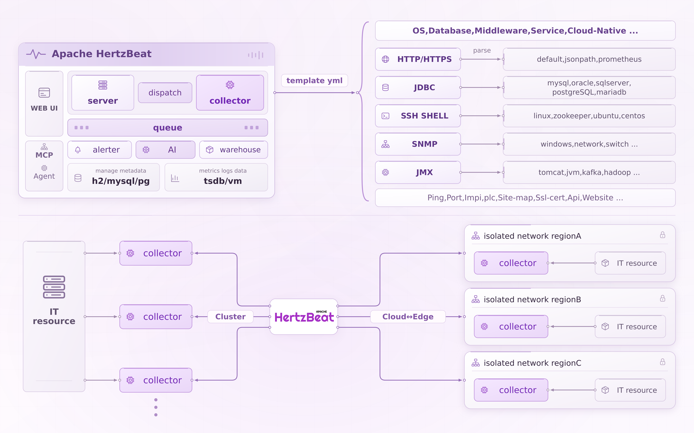

<p align="center">
  <a href="https://hertzbeat.apache.org">
     
  </a>
</p>

<p align="center">
<b>Readme</b>:
<a href="README.md">English</a> | <a href="README_CN.md">中文</a> | <b><a href="README_JP.md">日本語</a></b>
</p>

[](https://discord.gg/Fb6M73htGr)
[](https://x.com/hertzbeat1024)
[](https://www.bestpractices.dev/projects/8139)
[](https://app.codecov.io/gh/apache/hertzbeat)
[](https://hub.docker.com/r/apache/hertzbeat)
[](https://artifacthub.io/packages/search?repo=hertzbeat)
[](https://www.youtube.com/channel/UCri75zfWX0GHqJFPENEbLow)
[](https://gitpod.io/#https://github.com/apache/hertzbeat)


**公式サイト: [hertzbeat.apache.org](https://hertzbeat.apache.org)**
**メール:**　メーリングリストに登録するために、<a href="mailto:dev-subscribe@hertzbeat.apache.org">dev-subscribe@hertzbeat.apache.org</a>にメールを送ってください。


## 🎡 <font color="green">紹介</font>

[Apache HertzBeat™](https://github.com/apache/hertzbeat) は AI 駆動の次世代オープンソースリアルタイム観測システムです。メトリクスとログの統一収集、アラートの一元配信、インテリジェント管理分析。エージェント不要、高性能クラスタ、強力なカスタム監視とステータスページ構築機能を提供します。

### 特性

- **収集+分析+アラート+通知**を一つのプラットフォームに統合し、HertzBeat AI 駆動の新しいインタラクションと機能、内蔵 MCP Server 機能を提供。
- 統一メトリクスプラットフォーム、エージェントレス、Prometheus互換、アプリケーションサービス、プログラム、データベース、キャッシュ、オペレーティングシステム、ビッグデータ、ミドルウェア、Webサーバー、クラウドネイティブ、ネットワーク、カスタム監視などをサポート。
- 統一ログプラットフォーム、OTLP プロトコルを通じて複数のログソースをシームレスに統合してレポート。
- 統一アラートプラットフォーム、内部アラートと様々な外部アラートソースを統合接続、統一アラート処理分析、柔軟なリアルタイムと周期的閾値ルール、グループ収束、サイレンス、抑制など。
- 統一メッセージ配信、アラートプラットフォームで処理後、`メール` `Discord` `Slack` `Telegram` `DingTalk` `WeChat` `FeiShu` `SMS` `Webhook` `ServerChan` などの方法で配信通知。
- `Http、Jmx、Ssh、Snmp、Jdbc、Prometheus`などのプロトコルを設定可能にし、テンプレート`YML`ファイルをオンラインで設定するだけで、あらゆるメトリクスを収集できるようにします。HertzBeatでオンライン設定するだけで、`K8s`や`Docker`のような新しい監視タイプに素早く対応できることを想像してみてください。
- 高性能で、コレクタークラスタの水平拡張、マルチ分離ネットワーク監視、クラウドエッジ協調をサポート。
- 強力なステータスページ構築機能を提供し、サービスのリアルタイムステータスをユーザーに簡単に伝達。

> `HertzBeat`の統一プラットフォーム、AI インテリジェンス、強力なカスタマイズ、多種類サポート、高性能、容易な拡張性は、ユーザーが迅速かつ便利に観測要件を実現することを支援することを目的としています。

----

----

## 🥐 モジュール



## 🐕 クイックスタート

- HertzBeat をローカルに展開する場合は、以下のデプロイメントドキュメントを参照してください。

### 🍞 HertzBeatのインストール
> HertzBeatは、ソースコードのインストールとブート、Dockerコンテナの実行とインストールパッケージによるインストールとデプロイをサポートし、CPUアーキテクチャはx86/arm64をサポートします。

##### 方式１：Docker

1. `docker` で以下の指令を実行します：

   ```shell
   docker run -d -p 1157:1157 -p 1158:1158 --name hertzbeat apache/hertzbeat
   ```

2. スタート：`http://localhost:1157`にアクセスします。デフォルトのアカウントとパスワード：`admin/hertzbeat`。

3. コレクタークラスタのデプロイメント（オプション）

   ```shell
   docker run -d -e IDENTITY=custom-collector-name -e MANAGER_HOST=127.0.0.1 -e MANAGER_PORT=1158 --name hertzbeat-collector apache/hertzbeat-collector
   ```

   - `-e IDENTITY=custom-collector-name` ：コレクターのユニーク ID。
    - `-e MODE=public` ：実行モード(パブリッククラスタまたはプライベートクラウドエッジ)。
    - `-e MANAGER_HOST=127.0.0.1` ：メインhertzbeatサーバーのIP。
    - `-e MANAGER_PORT=1158` ：メインhertzbeatサーバポート。


詳細ステップ [Dockerで HertzBeat をインストール](https://hertzbeat.apache.org/docs/start/docker-deploy)

##### 方式２：インストールパッケージ

1. リリースパッケージ `apache-hertzbeat-xx-bin.tar.gz` をダウンロードします [Download](https://hertzbeat.apache.org/docs/download)
2. HertzBeat の設定ファイル `hertzbeat/config/application.yml` を編集します（任意）
3. コマンド `$ ./bin/startup.sh` または `bin/startup.bat` を実行します
4. ブラウザで `http://localhost:1157` にアクセスします。デフォルトのアカウントとパスワードは `admin/hertzbeat` です
5. コレクタークラスタのデプロイメント（オプション）
   - 別ホストにコレクターのインストールパッケージ `apache-hertzbeat-collector-xx-bin.tar.gz`（JVM コレクター）または対象プラットフォーム向けの Native コレクターパッケージ（例: `apache-hertzbeat-collector-native-xx-linux-amd64-bin.tar.gz`、`apache-hertzbeat-collector-native-xx-windows-amd64-bin.zip`）をダウンロードします [Download](https://hertzbeat.apache.org/docs/download)
   - コレクターの設定ファイル `hertzbeat-collector/config/application.yml` を編集します
     ```yaml
     collector:
       dispatch:
         entrance:
           netty:
             enabled: true
             identity: ${IDENTITY:}
             mode: ${MODE:public}
             manager-host: ${MANAGER_HOST:127.0.0.1}
             manager-port: ${MANAGER_PORT:1158}
     ```
     - `identity: ${IDENTITY:}`：コレクターのユニークID。
     - `mode: ${MODE:public}`：実行モード(パブリッククラスタまたはプライベートクラウドエッジ)。
     - `manager-host: ${MANAGER_HOST:127.0.0.1}`：メインhertzbeatサーバーのIP。
     - `manager-port: ${MANAGER_PORT:1158}`：メインhertzbeatサーバポート。
   - `ext-lib` に JDBC ドライバーを置かない場合、MySQL、MariaDB、OceanBase は組み込みのクエリエンジンを使って Native コレクターパッケージでも監視できます。TiDB も SQL クエリのメトリクスセットについては同じルールです。
   - `ext-lib` に `mysql-connector-j` を置いた場合は、再起動後に組み込みサーバーコレクターまたは JVM コレクターが MySQL、MariaDB、OceanBase で自動的に JDBC を優先します。TiDB も SQL クエリのメトリクスセットについては同じルールで、HTTP メトリクスは影響を受けません。Oracle と DB2 は引き続き外部 JDBC ドライバーに依存するため、JVM コレクターパッケージを使用してください。
   - JVM コレクターのインストールパッケージは `$ ./bin/startup.sh` または `bin/startup.bat`、Linux/macOS の Native コレクターパッケージは `$ ./bin/startup.sh`、Windows の Native コレクターパッケージは `bin\\startup.bat` で起動します。
   - メインの HertzBeat サービス `http://localhost:1157` にアクセスすると、登録された新しいコレクターを確認できます。

詳細ステップ [インストールパッケージで HertzBeat をインストール](https://hertzbeat.apache.org/docs/start/package-deploy)

##### 方式３：ローカルの実行

1. ローカルの実行には、バックエンドのプロジェクト`hertzbeat-startup`とフロントエンドのプロジェクト`web-app`を起動する必要があります。
2. バックエンド：`maven3+`、`Java25`、`lombok` の環境が必要です。`YML` 設定を修正し、Java 仮想マシンパラメータに `--add-opens=java.base/java.nio=org.apache.arrow.memory.core,ALL-UNNAMED` を追加して `hertzbeat-startup` を起動します。
3. フロントエンド：`nodejs` と `pnpm` の環境が必要です。ローカルのバックエンドが立ち上がったら、`web-app` ディレクトリで `pnpm install` を実行し、続けて `pnpm start` を実行します。
4. スタート：`http://localhost:4200`にアクセスします。デフォルトのアカウントとパスワード：`admin/hertzbeat`。

詳細ステップ [貢献ガイド](CONTRIBUTING.md)

##### 方式４：Docker-Compose

[Docker-Compose 部署脚本](script/docker-compose)でpostgresql/mysqlデータベース、victoria-metrics、iotdb、またはtdengine時系列データベースとHertzBeat一括デプロイ。

詳細ステップ [Docker-Compose で HertzBeat をインストール](script/docker-compose/README.md)

##### 方式５：Kubernetes Helm Charts

Helm ChartでHertzBeatクラスタコンポーネントをKubernetesクラスタに一括デプロイ。

詳細ステップ [Artifact Hub](https://artifacthub.io/packages/helm/hertzbeat/hertzbeat)

**HAVE FUN**

## ✨ Contributors

Thanks these wonderful people, welcome to join us:
[貢献ガイド](CONTRIBUTING.md)

<a href="https://github.com/apache/hertzbeat/graphs/contributors">
  
</a>

## 💬 コミュニティ交流

##### チャネル

[メール](https://lists.apache.org/list.html?dev@hertzbeat.apache.org) : メーリングリストに登録するために、```dev-subscribe@hertzbeat.apache.org```にメールを送ってください。

[Chat On Discord](https://discord.gg/Fb6M73htGr)

WeChatグループ : `ahertzbeat` を検索.

WeChat公式アカウント : `usthecom`を検索.

[Github Discussion](https://github.com/apache/hertzbeat/discussions)

[Follow Us Twitter](https://x.com/hertzbeat1024)

[Subscribe YouTube](https://www.youtube.com/channel/UCri75zfWX0GHqJFPENEbLow)


##### Open-Source Project Build From Open-Source

HertzBeat is built on so many great open source projects, thanks to them!

- `Java Spring SpringBoot Jpa Maven Assembly Netty Lombok Sureness Protobuf HttpClient Guava SnakeYaml JsonPath ...`
- `TypeScript Angular NG-ZORRO NG-ALAIN NodeJs Npm Html Less Echarts Rxjs ZoneJs MonacoEditor SlickCarousel Docusaurus ...`


## Landscape

<p align="left">
&nbsp;&nbsp;
<br /><br />
HertzBeat has been included in the <a href="https://landscape.cncf.io/?item=observability-and-analysis--observability--hertzbeat">
CNCF Observability And Analysis - Observability Landscape.</a>
</p>

## 🛡️ License
[`Apache License, Version 2.0`](https://www.apache.org/licenses/LICENSE-2.0.html)
