> Hertzbeat official template marketplace: users can freely upload, download, view, search and share monitoring template files.

## Basic Functions

### Search

💡 Guest availability

> Display template name, brief description, favorites, downloads, views and other information

1. **No filter: displayed in order of upload**

   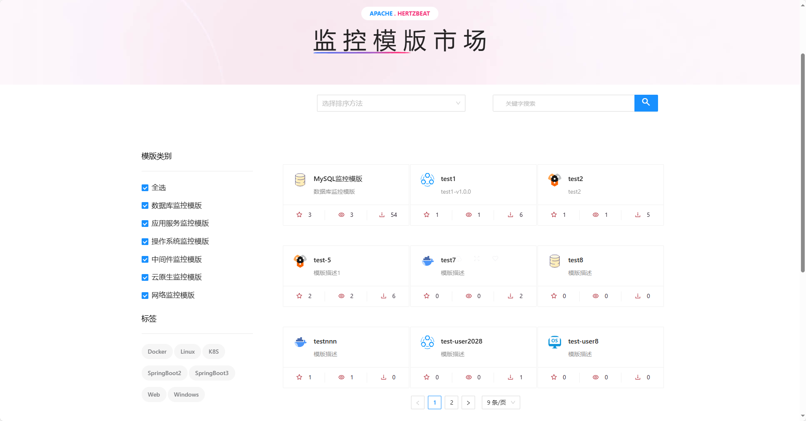

2. **Filtering by category: currently divided into six categories**

   > **📋Todo:** develop tag function, subdivided within the category, such as database monitoring template can be divided into MySQL, Oracle, etc.

   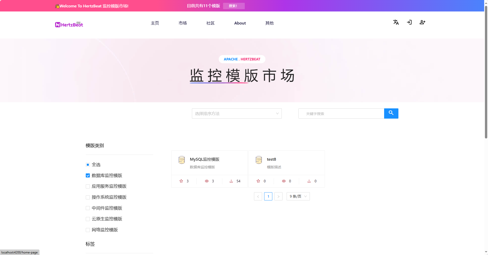

3. **Fuzzy search by Title**

   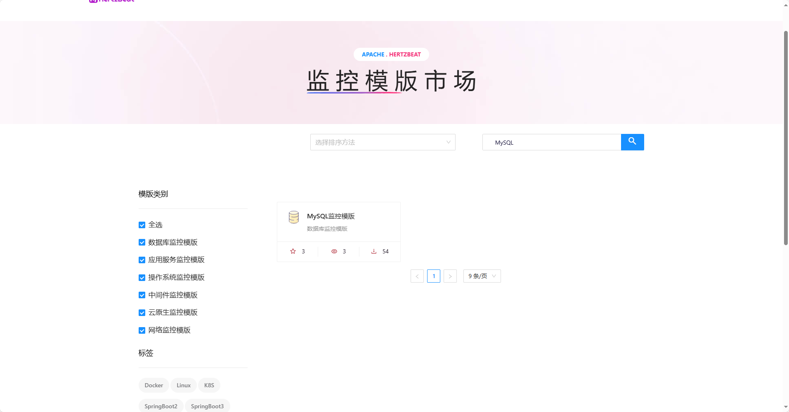

4. **Hover window function: download the latest version, view details, favorite/un-favorite**

   > Show if the user has favorites after logging in

   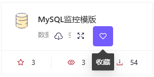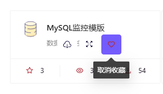

5. **Sort: Eight Sorting Methods**

   > **📋Todo:** Waiting for the actual installation

### Template Detail

💡 Guest availability

   > Display basic information about the template, such as name, author, update time, version information, etc.

1. **Info: Summary information, detailed information and other information**

   > **📋Todo:** Upgrade to MarkDown format

   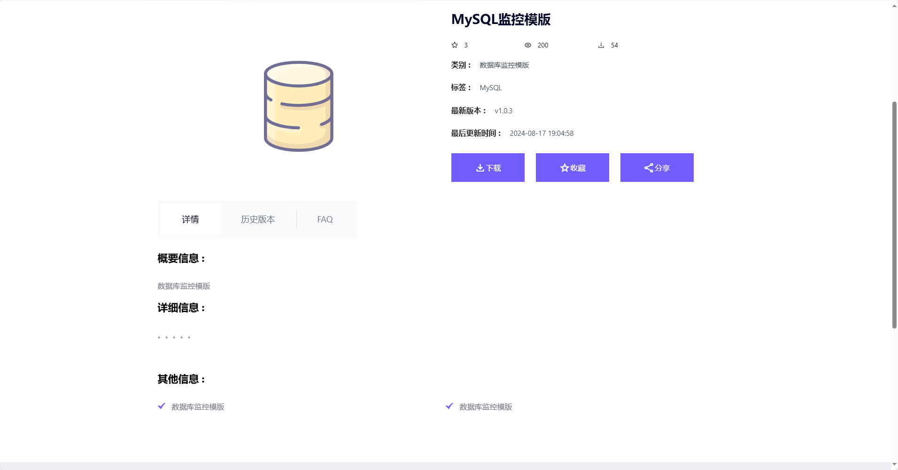

2. **Version: Historical version download, sharing and basic information display**

   > **📋Todo:** Set up a view function for each historical version to display information such as the version description.

   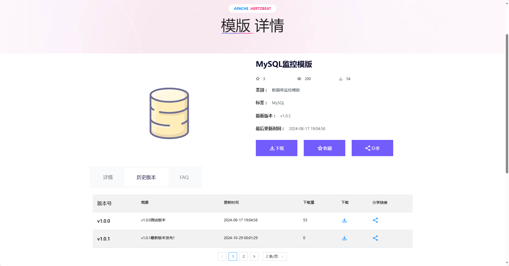

3. **FAQ**

   > **📋Todo:** Discussion or issue Q&A section

   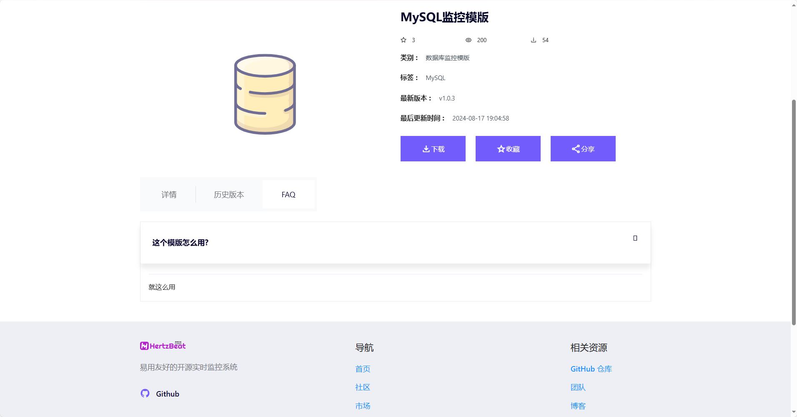

4. **Download**

   > The latest version can be downloaded directly from the list hover window.  
   > The latest version can also be downloaded directly from the template detail page.  
   > The historical version can be downloaded from the version page.  

   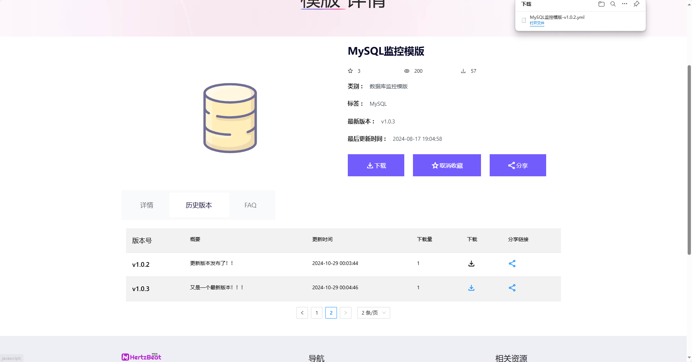

5. **Share**

   > Template details page to share the latest version.  
   > Version page to share historical versions.  
   > Sharing will automatically copy the sharing URL to the clipboard, and the person being shared can download the file via that URL  
   >
   > **📋Todo:** Shared template detail page is accessed through the URL of the shared template, and the shared person is free to choose whether to download or not.

   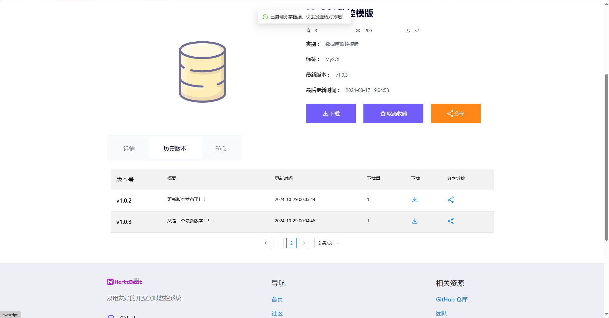

### User Center

💡 User availability

   > Provide asset management, collection management and upload function  
>
   > **📋Todo:** Overview page, notification page, user settings page

1. **Asset: Manage all templates uploaded by user themselves**

   > Provides the ability to download the latest version and view details  
   >
   > **📋Todo:** Function to update template information

   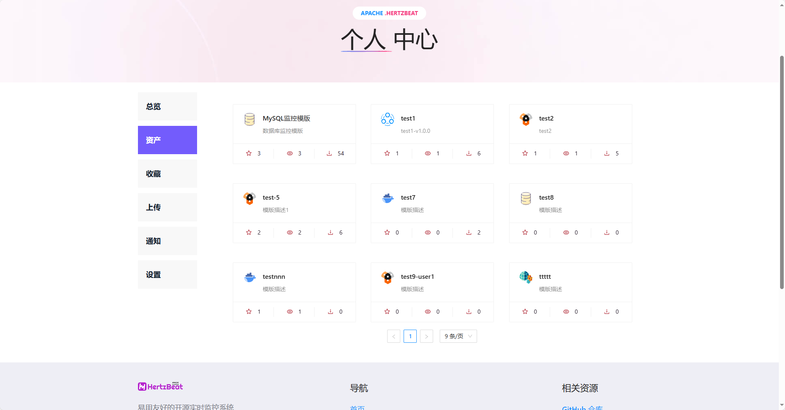

   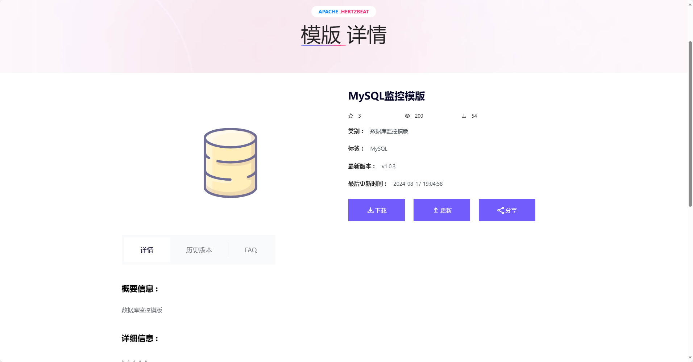

2. **Version Upgrade**

   > The user defines the new version number under this template family, updates the version information, and uploads the latest version of the file

   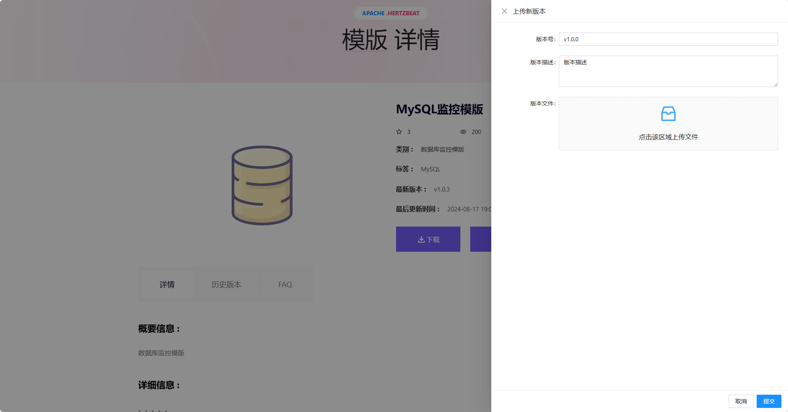

3. **Star**

   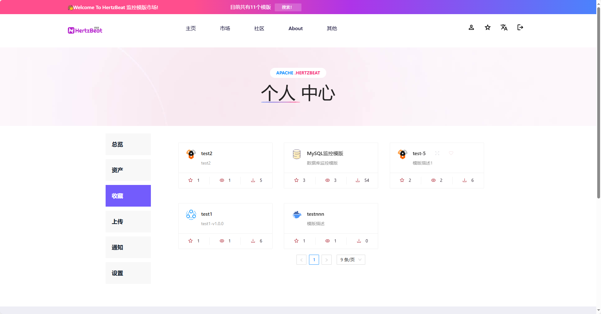

   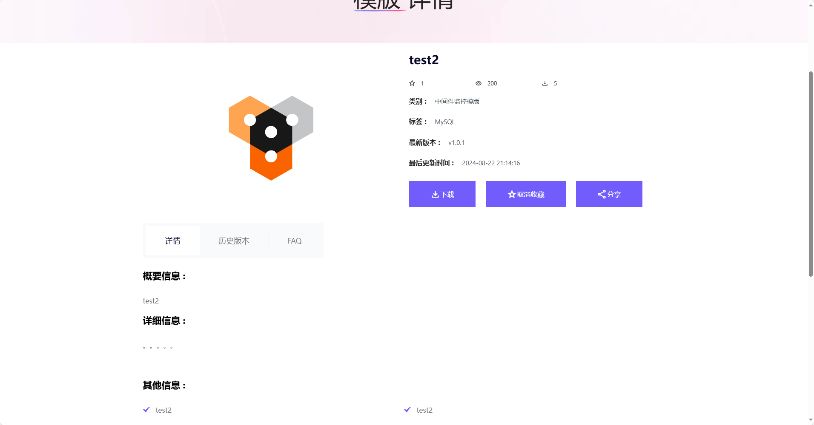

4. **Upload**

   > Create a new template series and upload the first version of the file  
   >
   > Fill in the template name, select the template category, fill in the description information and version information, and upload files

   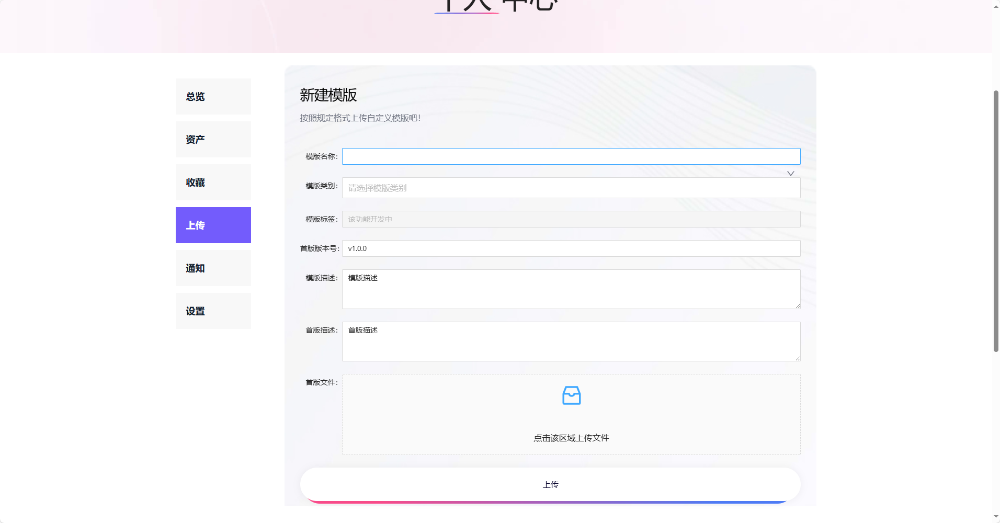

### Sign Up & Login

💡 Guest availability

1. **Sign up**

   > Usernames can be duplicated, but email addresses are unique  
   >
   > **📋Todo:** Captcha function, email verification function

   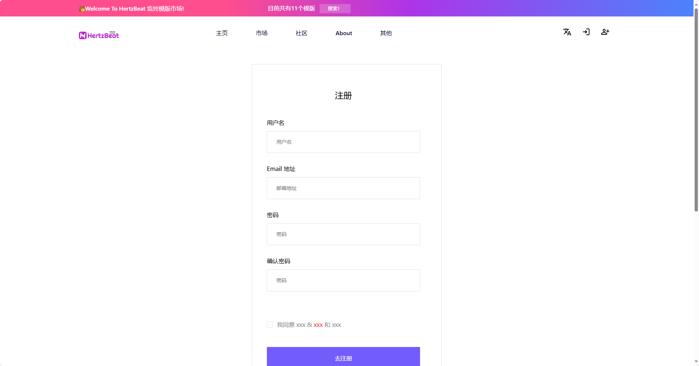

2. **Login**

   > **📋Todo:** Captcha function and forgot password function

   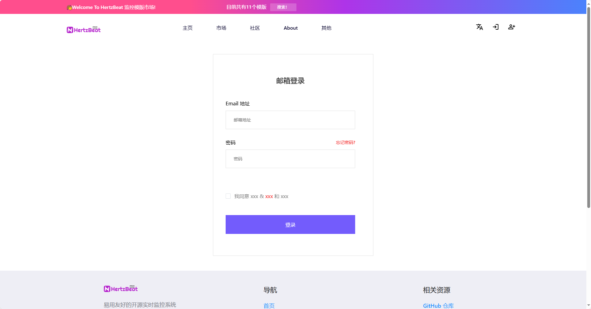

## Development Steps

   > Download `template-marketplace/hertzbeat-template-hub` and `template-marketplace/hertzbeat-template-hub-web-app` projects respectively

   The front-end project in accordance with README.md directly start

   The back-end project steps:

   1. Run the `sql` script in the `template-marketplace/hertzbeat-template-hub/sql` to create database tables
   2. Install MinIO
   3. Config `MySQL` and `MinIO` in the `application.yml`
   4. Start the back-end project

Other issues can be fed back through the communication group ISSUE!
