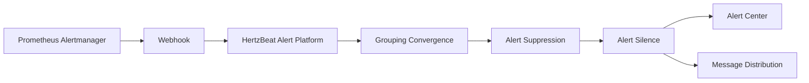

# Prometheus Alert Integration

This document describes how to send alerts from Prometheus AlertManager to the HertzBeat alert platform.

### Alertmanager Configuration Webhook

1. Add the webhook configuration to the Alertmanager configuration file.

    ```yaml
    receivers:
      - name: 'webhook'
        webhook_configs:
          - url: 'http://${hertzbeat_host}:1157/api/alerts/report/alertmanager'
            http_config:
              headers:
              Authorization: 'Bearer {token}'
            send_resolved: true
    ```
- `http://${hertzbeat_ip}:8080/api/alerts/report` is the webhook interface address provided by HertzBeat.
- `send_resolved: true` indicates that alert recovery information will be sent.
- The {token} in `Authorization` is the token provided by HertzBeat.

2. Restart the Alertmanager service.

### Configuration Verification

- Trigger Prometheus AlertManager alerts.
- Check the alert data processing in the HertzBeat alert platform to verify if the alert data is correct.

### Data Flow:



### Common Issues

- Ensure that the webhook address in the Alertmanager configuration file is correct and that the network is smooth.
- Check whether the alerts from Alertmanager are triggered and sent to the HertzBeat alert platform.
