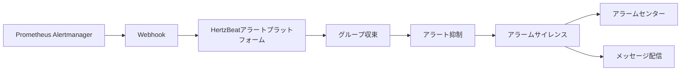

> Prometheus AlertManager のアラートを HertzBeat アラートプラットフォームに送信します。

### Alertmanager の Webhook 設定

1. Alertmanager の設定ファイルで webhook を設定する。

```yaml
receivers:
  - name: 'webhook'
    webhook_configs:
      - url: 'http://{hertzbeat_host}:1157/api/alerts/report/alertmanager'
        send_resolved: true
        http_config:
          authorization: 
            type: 'Bearer'
            credentials: '{token}'
```

- `http://{hertzbeat_host}:1157/api/alerts/report/alertmanager` は、HertzBeat の webhook URLです。
- `send_resolved: true` は、アラート解決情報を送信することを意味します。
- `credentials` の `{token}` はHertzBeatが提供するtokenです。

2. Alertmanager のサービスを再起動する。

### 設定の検証

- Prometheus AlertManager のアラートをトリガーする。
- HertzBeat アラートプラットフォームでアラートデータを閲覧し、正しいか検証する。

### データフロー



### FAQ

- Alertmanager の設定ファイルで webhook アドレスが正しく、ネットワークが接続されていることを確認してください。
- Alertmanagerのアラートがトリガーされたかどうか、またHertzBeatアラートプラットフォームに送信されたかどうかを確認してください。
