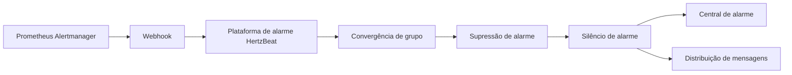

> Envie alarmes do Prometheus AlertManager para a plataforma de alarme HertzBeat。 

### Webhook de configuração do Alertmanager

1. Adicionar configuração de webhook no arquivo de configuração do Alertmanager.

```yaml
receivers:
  - name: 'webhook'
    webhook_configs:
      - url: 'http://{hertzbeat_host}:1157/api/alerts/report/alertmanager'
        send_resolved: true
        http_config:
          authorization: 
            type: 'Bearer'
            credentials: '{token}'
```

- `http://{hertzbeat_host}:1157/api/alerts/report/alertmanager` O endereço da interface do webhook fornecido para HertzBeat.
- `send_resolved: true` Indica o envio de informações de recuperação de alarme.
- `{token}` em `credenciais` é o token fornecido pela HertzBeat.

2. Reinicie o serviço Alertmanager

### Verificação de configuração

- Acione o alarme do Prometheus AlertManager.
- Processe e visualize os dados de alarme na plataforma de alarme HertzBeat para verificar se os dados de alarme estão corretos.

### Fluxo de dados:



### Perguntas frequentes

- Certifique-se de que o endereço do webhook no arquivo de configuração do Alertmanager esteja correto e que a rede esteja aberta.
- Verifique se o alarme Alertmanager é acionado e se é enviado para a plataforma de alarmes HertzBeat.
