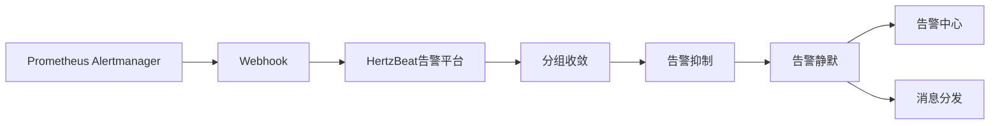

> 将 Prometheus AlertManager 的告警发送到 HertzBeat 告警平台。 

### Alertmanager 配置 Webhook

1. 在 Alertmanager 配置文件中添加 webhook 配置。

```yaml
receivers:
  - name: 'webhook'
    webhook_configs:
      - url: 'http://{hertzbeat_host}:1157/api/alerts/report/alertmanager'
        send_resolved: true
        http_config:
          authorization: 
            type: 'Bearer'
            credentials: '{token}'
```

- `http://{hertzbeat_host}:1157/api/alerts/report/alertmanager` 为 HertzBeat 提供的 webhook 接口地址。
- `send_resolved: true` 表示发送告警恢复信息。
- `credentials` 内的 `{token}` 为 HertzBeat 提供的 token。

2. 重启 Alertmanager 服务。

### 配置验证

- 触发 Prometheus AlertManager 告警。
- 在 HertzBeat 告警平台中对告警数据处理查看，验证告警数据是否正确。

### 数据流转:



### 常见问题

- 确保 Alertmanager 配置文件中的 webhook 地址正确，且网络通畅。
- 检查 Alertmanager 的告警是否触发，是否发送到 HertzBeat 告警平台。
