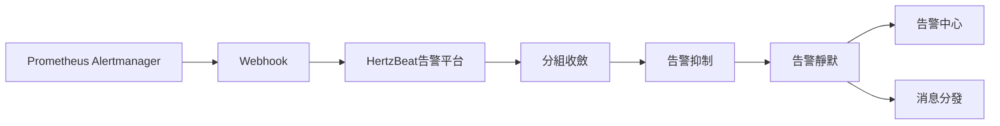

> 將 Prometheus AlertManager 的告警發送到 HertzBeat 告警平台。

### Alertmanager 配置 Webhook

1. 在 Alertmanager 配置文件中添加 webhook 配置。

```yaml
receivers:
  - name: 'webhook'
    webhook_configs:
      - url: 'http://{hertzbeat_host}:1157/api/alerts/report/alertmanager'
        send_resolved: true
        http_config:
          authorization: 
            type: 'Bearer'
            credentials: '{token}'
```

- `http://{hertzbeat_host}:1157/api/alerts/report/alertmanager` 為 HertzBeat 提供的 webhook 接口地址。
- `send_resolved: true` 表示發送告警恢復信息。
- `credentials` 內的 `{token}` 為 HertzBeat 提供的 token。

2. 重啟 Alertmanager 服務。

### 配置驗證

- 觸發 Prometheus AlertManager 告警。
- 在 HertzBeat 告警平台中對告警數據處理查看，驗證告警數據是否正確。

### 數據流轉:



### 常見問題

- 確保 Alertmanager 配置文件中的 webhook 地址正確，且網絡通暢。
- 檢查 Alertmanager 的告警是否觸發，是否發送到 HertzBeat 告警平台。
