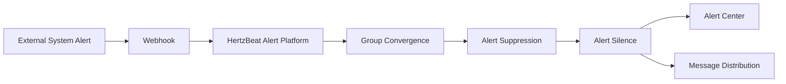

> HertzBeat provides an external API interface that allows external systems to push alert data to the HertzBeat alert platform via Webhook.

### API Endpoint

`POST /api/alerts/report`

### Request Headers

- `Content-Type`: `application/json`
- `Authorization`: `Bearer {token}`

### Request Body

```json
{
  "labels": {
    "alertname": "HighCPUUsage",
    "priority": "critical",
    "instance": "343483943"
  },
  "annotations": {
    "summary": "High CPU usage detected"
  },
  "content": "The CPU usage on instance 343483943 is critically high.",
  "status": "firing",
  "triggerTimes": 3,
  "startAt": 1736580031832,
  "activeAt": 1736580039832,
  "endAt": null
}
```

Field Description

- `labels`: Alert labels
  - `alertname`: Name of the alert rule
  - `priority`: Alert priority (warning, critical)
  - `instance`: Alert instance
- `annotations`: Alert annotation information
  - `summary`: Alert summary
  - `description`: Detailed description of the alert
- `content`: Alert content
- `status`: Alert status (firing, resolved)
- `triggerTimes`: Number of times the alert was triggered
- `startAt`: Start time of the alert
- `activeAt`: Time when the alert became active
- `endAt`: End time of the alert (if resolved)

### Configuration Verification

- After the third-party system triggers an alert, it calls HertzBeat's `/api/alerts/report` interface via webhook to push alert data to the HertzBeat alert platform. 
- Check the alert data processing in the HertzBeat alert platform to verify if the alert data is correct.

### Data Flow:



### Common Issues

- Ensure the HertzBeat URL is accessible from the third-party system server. 
- Check the logs of the third-party system for messages indicating whether the alert was successfully sent or failed.
