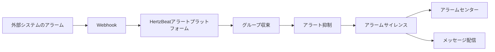

> HertzBeat は外部システムに対してAPIインターフェースを提供し、外部システムはWebhook方式でこのインターフェースを呼び出して、アラートデータをHertzBeatアラートプラットフォームにプッシュすることができます。

### インターフェースエンドポイント

`POST /api/alerts/report`

### リクエストヘッダ

- `Content-Type`: `application/json`
- `Authorization`: `Bearer {token}`

### リクエストボディ

```json
{
  "labels": {
    "alertname": "HighCPUUsage",
    "priority": "critical",
    "instance": "343483943"
  },
  "annotations": {
    "summary": "High CPU usage detected"
  },
  "content": "The CPU usage on instance 343483943 is critically high.",
  "status": "firing",
  "triggerTimes": 3,
  "startAt": 1736580031832,
  "activeAt": 1736580039832,
  "endAt": null
}
```

フィールド説明

- `labels`: アラートラベル
  - `alertname`: アラートルール名
  - `priority`: アラートレベル (warning, critical)
  - `instance`: アラートインスタンス
- `annotations`: アラート注釈情報
  - `summary`: アラート概要
  - `description`: アラート詳細説明
- `content`: アラート内容
- `status`: アラートステータス (firing, resolved)
- `triggerTimes`: アラートトリガー回数
- `startAt`: アラート開始時間
- `activeAt`: アラートアクティブ時間
- `endAt`: アラート終了時間


### 設定検証
サードパーティシステムがアラートをトリガーした後、Webhookを使用してHertzBeatの `/api/alerts/report` インターフェースをコールバックし、アラートデータをHertzBeatアラートプラットフォームにプッシュします。
HertzBeatアラートプラットフォームでアラートデータを処理し、アラートデータが正しいかどうかを確認します。

### データフロー




### FAQ
- HertzBeatのURLがサードパーティシステムのサーバーからアクセス可能であることを確認してください。
- サードパーティシステムのログにアラート送信が成功または失敗したメッセージがないか確認してください。
