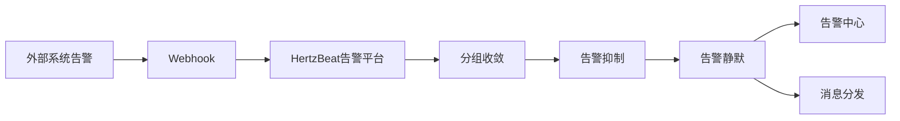

> HertzBeat 对外提供 api 接口，外部系统可以通过 Webhook 方式调用此接口将告警数据推送到 HertzBeat 告警平台。
> HertzBeat は外部システムに対してAPIインターフェースを提供し、外部システムはWebhook方式でこのインターフェースを呼び出して、アラートデータをHertzBeatアラートプラットフォームにプッシュすることができます。

### 接口端点
### インターフェースエンドポイント

`POST /api/alerts/report`

### 请求头
### リクエストヘッダ


- `Content-Type`: `application/json`
- `Authorization`: `Bearer {token}`

### 请求体

```json
{
  "labels": {
    "alertname": "HighCPUUsage",
    "priority": "critical",
    "instance": "343483943"
  },
  "annotations": {
    "summary": "High CPU usage detected"
  },
  "content": "The CPU usage on instance 343483943 is critically high.",
  "status": "firing",
  "triggerTimes": 3,
  "startAt": 1736580031832,
  "activeAt": 1736580039832,
  "endAt": null
}
```

字段說明

- `labels`: 告警標籤
  - `alertname`: 告警規則名稱
  - `priority`: 告警級別 (warning, critical)
  - `instance`: 告警實例
- `annotations`: 告警註釋信息
  - `summary`: 告警摘要
  - `description`: 告警詳細描述
- `content`: 告警內容
- `status`: 告警狀態 (firing, resolved)
- `triggerTimes`: 告警觸發次數
- `startAt`: 告警開始時間
- `activeAt`: 告警激活時間
- `endAt`: 告警結束時間

フィールド説明

labels: アラートラベル
alertname: アラートルール名
priority: アラートレベル (warning, critical)
instance: アラートインスタンス
annotations: アラート注釈情報
summary: アラート概要
description: アラート詳細説明
content: アラート内容
status: アラートステータス (firing, resolved)
triggerTimes: アラートトリガー回数
startAt: アラート開始時間
activeAt: アラートアクティブ時間
endAt: アラート終了時間


### 配置验证

- 第三方系统触发告警后通过 webhook 回调 HertzBeat 的 `/api/alerts/report` 接口，将告警数据推送到 HertzBeat 告警平台。 
- 在 HertzBeat 告警平台中对告警数据处理查看，验证告警数据是否正确。

### 設定検証
サードパーティシステムがアラートをトリガーした後、Webhookを使用してHertzBeatの /api/alerts/report インターフェースをコールバックし、アラートデータをHertzBeatアラートプラットフォームにプッシュします。
HertzBeatアラートプラットフォームでアラートデータを処理し、アラートデータが正しいかどうかを確認します。


### 数据流转:




### FAQ

- 确保 HertzBeat URL 可以被第三方系统服务器访问。 
- 检查第三方系统日志中是否有告警发送成功失败的消息。

- HertzBeatのURLがサードパーティシステムのサーバーからアクセス可能であることを確認してください。
- サードパーティシステムのログにアラート送信が成功または失敗したメッセージがないか確認してください。
