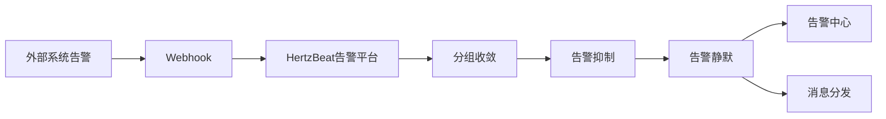

HertzBeat 提供 API 接口，外部系统可以通过 Webhook 方式调用此接口，将告警数据推送到 HertzBeat 告警平台。


## 接口端点

`POST /api/alerts/report`


## 请求头

* `Content-Type`: `application/json`
* `Authorization`: `Bearer {token}`


## 请求体

```json
{
  "labels": {
    "alertname": "HighCPUUsage",
    "priority": "critical",
    "instance": "343483943"
  },
  "annotations": {
    "summary": "High CPU usage detected"
  },
  "content": "The CPU usage on instance 343483943 is critically high.",
  "status": "firing",
  "triggerTimes": 3,
  "startAt": 1736580031832,
  "activeAt": 1736580039832,
  "endAt": null
}
```

### 字段说明

* `labels`: 告警标签
  * `alertname`: 告警规则名称
  * `priority`: 告警级别 (`warning`, `critical`)
  * `instance`: 告警实例
* `annotations`: 告警注释信息
  * `summary`: 告警摘要
  * `description`: 告警详细描述
* `content`: 告警内容
* `status`: 告警状态 (`firing`, `resolved`)
* `triggerTimes`: 告警触发次数
* `startAt`: 告警开始时间
* `activeAt`: 告警激活时间
* `endAt`: 告警结束时间


## 配置验证

* 第三方系统触发告警后，通过 Webhook 回调 HertzBeat 的 `/api/alerts/report` 接口，将告警数据推送到 HertzBeat 告警平台。
* 在 HertzBeat 告警平台中处理并查看告警数据，验证告警数据是否正确。


## 数据流转




## 常见问题

* 确保 HertzBeat URL 可以被第三方系统服务器访问。
* 检查第三方系统日志中是否有告警发送成功或失败的消息。
