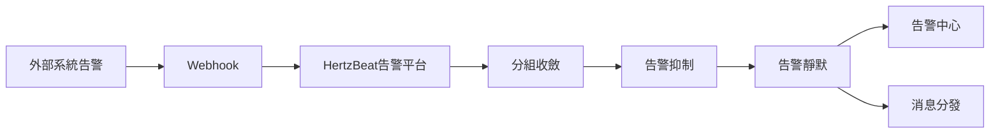

> HertzBeat 對外提供 API 接口，外部系統可以通過 Webhook 方式調用此接口將告警數據推送到 HertzBeat 告警平台。

### 接口端點

`POST /api/alerts/report`

### 請求頭

- `Content-Type`: `application/json`
- `Authorization`: `Bearer {token}`

### 請求體

```json
{
  "labels": {
    "alertname": "HighCPUUsage",
    "priority": "critical",
    "instance": "343483943"
  },
  "annotations": {
    "summary": "檢測到高 CPU 使用率"
  },
  "content": "實例 343483943 的 CPU 使用率極高。",
  "status": "firing",
  "triggerTimes": 3,
  "startAt": 1736580031832,
  "activeAt": 1736580039832,
  "endAt": null
}
```

字段說明

- `labels`: 告警標籤
  - `alertname`: 告警規則名稱
  - `priority`: 告警級別 (warning, critical)
  - `instance`: 告警實例
- `annotations`: 告警註釋信息
  - `summary`: 告警摘要
  - `description`: 告警詳細描述
- `content`: 告警內容
- `status`: 告警狀態 (firing, resolved)
- `triggerTimes`: 告警觸發次數
- `startAt`: 告警開始時間
- `activeAt`: 告警激活時間
- `endAt`: 告警結束時間

### 配置驗證

- 第三方系統觸發告警後通過 webhook 回調 HertzBeat 的 `/api/alerts/report` 接口，將告警數據推送到 HertzBeat 告警平台。 
- 在 HertzBeat 告警平台中對告警數據處理查看，驗證告警數據是否正確。

### 數據流轉:



### 常見問題

- 確保 HertzBeat URL 可以被第三方系統服務器訪問。 
- 檢查第三方系統日誌中是否有告警發送成功失敗的消息。
